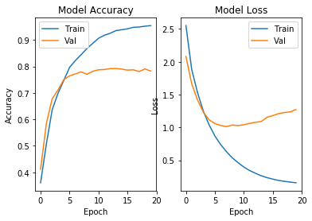
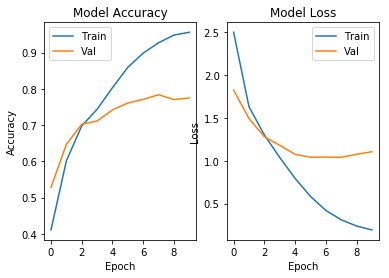
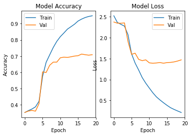

# Word Vectors

En este trabajo, utilizaremos **embeddings** para resolver un problema de clasificación de texto. Los embeddings, representaciones distribuidas y vectoriales de elementos, son un concepto muy común en el mundo del deep learning. Los **word vectors** que hemos visto en clase son una representación en forma de embedding de las palabras.

Para realizar este trabajo y sacarle el máximo partido, se recomienda ver los siguientes vídeos de clase:

*   Clasificación de texto con Word Vectors.
*   Análisis de overfitting con un modelo bag of words.
*   Clasificación de texto con RNN

Vamos a utilizar el dataset **"Reuters newswire topics classification"**, disponible desde Keras de manera similar al dataset de IMDB ([ver documentación](https://keras.io/datasets/#reuters-newswire-topics-classification)).

---

Se pide:

Entrenar un modelo **utilizando embeddings** que consiga un **65% de accuracy en test (55% si usamos RNNs)**, mostrando el entrenamiento y el resultado final.
 
Tenemos varias opciones para entrenar modelos con embeddings. El alumno puede explorar más de una pero es suficiente con conseguir un modelo que alcance la accuracy requerida:

*   Utilizar una **media de embeddings** al estilo de lo visto en el vídeo *Clasificación de texto con Word Vectors*
*   Utilizar una **CNN** sobre una secuencia de word vectors. Aquí necesitamos cambiar un poco la idea de convolución para actuar sobre sequencias de vectores. Keras incluye una [Convolución en 1D](https://keras.io/layers/convolutional/#conv1d) que puede ser utilizada en este caso, con un ejemplo de uso en la documentación. Una forma de hacer funcionar este esquema sería utilizar la convolución en 1D + max pooling.
*  Utilizar una **RNN** sobre una secuencia de word vectors, al estilo de lo visto en el vídeo *Clasificación de texto con RNN*. Para este problema es un poco complicado conseguir un buen modelo con RNNs, y además es más difícil experimentar ya que las redes recurrentes son modelos lentos de entrenar. Por eso, es suficiente con alcanzar un 55% de accuracy si optamos por utilizar un modelo de este estilo. Un buen consejo es emplear una red recurrente bidireccional como se ve en el vídeo *Clasificación de texto con RNN*.


---

Dos hiperparámetros importantes a elegir en el modelo son la **longitud de las secuencias de texto** y el **tamaño del vocabulario** para los embeddings. Podéis experimentar con ambos, o utilizar los mismos que se usan en los vídeos. Nótese que, al cortar todas las secuencias para que tengan el mismo tamaño, podríamos estar perdiendo mucho texto si elegimos un tamaño de secuencia demasiado pequeño. Igualmente, si las hacemos muy largas necesitaremos más tiempo para entrenar nuestros modelos. Una buena idea consiste en explorar los datos para ver cómo suelen ser de largos los textos y encontrar un buen trade-off para el tamaño de al secuencia.


---

Los embeddings que hemos visto en los vídeos se entrenan junto al modelo.  Una técnica frecuente es inicializar estos embeddings con word-vectors pre-entrenados en un gran corpus de texto, como hemos visto en clase. Esto puede ayudar ya que nuestro modelo empieza con unos embeddings que ya encapsulan significado. Si bien no es necesario para esta práctica, podéis ver cómo usar esta técnica [en el siguiente tutorial](https://blog.keras.io/using-pre-trained-word-embeddings-in-a-keras-model.html).


## Entrenamiento del Model

### Importación del Librerías


```python
import numpy as np
import keras
from keras.datasets import reuters
from keras.models import Sequential
from keras.layers import Dense, Dropout, Activation, Conv1D, MaxPooling1D
from keras.preprocessing.text import Tokenizer
import tensorflow as tf
import matplotlib.pyplot as plt
from keras import layers
```

    Using TensorFlow backend.
    

### Pre-procesamiento
En primer lugar, se carga los datos haciendo uso de la librería *reuters*. Además se hace un split en la carga para tener un 20% de datos de test.


```python
!pip install numpy==1.16.1
import numpy as np

from keras.datasets import reuters

max_words = 10000

print('Loading data...')
(x_train, y_train), (x_test, y_test) = reuters.load_data(path="reuters.npz",
                                                         num_words=max_words,
                                                         skip_top=0,
                                                         maxlen=None,
                                                         test_split=0.2,
                                                         seed=113,
                                                         start_char=1,
                                                         oov_char=2,
                                                         index_from=3)
```

    Requirement already satisfied: numpy==1.16.1 in /usr/local/lib/python3.6/dist-packages (1.16.1)
    Loading data...
    

Cada frase de nuestro dataset tiene una longitud distinta, por lo que es necesario normalizarlo para que estas sean iguales a lo largo del dataset.


```python
lenths = [len(x) for x in x_train]
print(lenths)
```

    [87, 56, 139, 224, 101, 116, 100, 100, 82, 106, 31, 59, 65, 316, 527, 76, 114, 17, 91, 77, 231, 108, 83, 29, 95, 110, 23, 373, 114, 354, 133, 222, 571, 155, 83, 208, 170, 269, 74, 19, 23, 78, 21, 377, 104, 299, 89, 56, 94, 139, 118, 36, 137, 107, 83, 66, 70, 112, 88, 51, 83, 123, 17, 185, 84, 52, 102, 73, 106, 486, 107, 82, 263, 172, 491, 190, 143, 62, 26, 88, 114, 38, 85, 112, 793, 104, 25, 21, 101, 28, 25, 81, 135, 73, 62, 18, 90, 266, 91, 64, 409, 92, 319, 166, 85, 200, 152, 474, 60, 58, 584, 71, 273, 51, 255, 28, 171, 143, 91, 46, 110, 77, 162, 24, 52, 175, 61, 95, 97, 259, 112, 73, 94, 17, 650, 23, 88, 309, 105, 89, 41, 314, 54, 374, 67, 160, 75, 207, 373, 84, 87, 74, 98, 136, 256, 95, 50, 108, 52, 100, 233, 86, 68, 47, 73, 158, 113, 23, 100, 80, 202, 104, 122, 101, 95, 118, 253, 192, 80, 183, 29, 604, 41, 103, 63, 147, 472, 58, 23, 37, 98, 73, 122, 812, 51, 179, 56, 60, 60, 25, 212, 34, 406, 122, 27, 86, 83, 43, 208, 26, 159, 65, 48, 335, 701, 314, 333, 68, 263, 124, 337, 180, 67, 81, 41, 92, 96, 185, 51, 75, 196, 54, 47, 48, 44, 166, 74, 111, 96, 167, 88, 100, 104, 36, 139, 35, 25, 17, 48, 88, 68, 36, 63, 115, 152, 82, 100, 181, 88, 109, 124, 234, 57, 199, 49, 131, 188, 192, 122, 290, 153, 297, 50, 71, 145, 185, 110, 93, 79, 116, 685, 28, 94, 260, 100, 88, 426, 24, 304, 28, 390, 224, 43, 48, 49, 17, 193, 158, 192, 169, 132, 132, 75, 94, 146, 41, 508, 61, 60, 121, 310, 232, 49, 49, 274, 297, 66, 142, 43, 17, 38, 245, 159, 57, 92, 149, 30, 67, 98, 16, 95, 481, 16, 16, 144, 178, 90, 56, 104, 303, 56, 222, 42, 222, 105, 87, 510, 30, 59, 81, 111, 82, 242, 26, 65, 67, 109, 83, 35, 100, 82, 106, 109, 58, 107, 65, 34, 41, 76, 57, 102, 748, 117, 23, 203, 78, 496, 139, 641, 75, 496, 524, 110, 17, 207, 34, 103, 96, 91, 170, 42, 100, 29, 807, 86, 58, 827, 116, 407, 174, 90, 100, 171, 59, 105, 255, 175, 171, 64, 17, 646, 103, 74, 226, 154, 18, 188, 96, 80, 719, 39, 70, 138, 392, 117, 70, 358, 188, 85, 83, 126, 93, 93, 17, 450, 34, 103, 200, 592, 35, 157, 82, 53, 67, 17, 27, 191, 222, 40, 31, 25, 133, 80, 226, 822, 16, 171, 204, 154, 81, 217, 82, 707, 100, 602, 48, 78, 44, 395, 44, 79, 53, 17, 55, 198, 70, 107, 161, 189, 79, 50, 82, 275, 64, 57, 41, 226, 68, 94, 118, 58, 75, 20, 173, 153, 199, 104, 52, 71, 107, 170, 79, 158, 202, 221, 200, 92, 188, 218, 51, 129, 75, 21, 17, 130, 134, 384, 61, 169, 25, 60, 293, 57, 105, 99, 112, 205, 593, 205, 239, 98, 94, 629, 397, 65, 220, 200, 132, 51, 269, 309, 204, 91, 54, 26, 163, 519, 91, 81, 208, 190, 73, 99, 96, 103, 75, 37, 45, 17, 874, 74, 107, 30, 28, 17, 30, 234, 16, 66, 233, 143, 373, 71, 92, 88, 311, 113, 674, 56, 40, 37, 107, 242, 171, 104, 258, 500, 75, 87, 90, 110, 126, 53, 17, 304, 23, 90, 57, 51, 88, 207, 100, 434, 73, 39, 17, 34, 199, 302, 136, 65, 119, 36, 310, 70, 136, 156, 229, 170, 136, 52, 84, 285, 158, 34, 16, 93, 98, 115, 197, 88, 175, 55, 304, 100, 74, 90, 109, 16, 66, 90, 88, 72, 102, 188, 140, 190, 72, 211, 103, 28, 85, 74, 55, 65, 90, 736, 66, 45, 133, 87, 216, 175, 62, 43, 576, 501, 66, 771, 703, 433, 73, 126, 95, 113, 90, 75, 91, 192, 120, 98, 328, 41, 54, 41, 43, 65, 248, 40, 98, 18, 149, 74, 49, 51, 93, 104, 99, 61, 62, 82, 81, 71, 83, 346, 610, 149, 130, 71, 199, 25, 1032, 87, 368, 143, 57, 59, 166, 217, 505, 32, 37, 70, 643, 24, 58, 49, 62, 287, 52, 693, 17, 722, 282, 192, 24, 58, 169, 89, 123, 564, 269, 109, 44, 173, 229, 184, 97, 583, 100, 41, 47, 58, 377, 68, 86, 17, 50, 177, 102, 600, 73, 192, 67, 79, 53, 78, 56, 187, 17, 17, 115, 94, 79, 67, 238, 85, 313, 200, 17, 95, 130, 143, 63, 244, 267, 18, 183, 178, 191, 78, 86, 40, 97, 232, 93, 83, 25, 90, 91, 36, 40, 150, 93, 204, 68, 78, 27, 316, 154, 383, 110, 80, 105, 43, 66, 105, 110, 60, 81, 160, 17, 56, 53, 149, 83, 177, 144, 63, 92, 244, 90, 39, 109, 455, 80, 17, 99, 189, 113, 74, 130, 64, 708, 105, 250, 68, 43, 33, 92, 90, 140, 746, 17, 91, 65, 146, 256, 485, 102, 17, 55, 51, 89, 58, 92, 93, 100, 225, 85, 113, 143, 86, 52, 113, 302, 101, 136, 296, 143, 88, 102, 171, 156, 251, 412, 143, 290, 21, 310, 63, 158, 198, 90, 77, 374, 17, 34, 186, 90, 50, 56, 90, 120, 130, 45, 96, 108, 185, 44, 187, 59, 17, 67, 269, 114, 234, 57, 94, 734, 102, 93, 240, 402, 108, 82, 17, 50, 65, 18, 77, 49, 65, 186, 153, 26, 113, 363, 49, 295, 81, 96, 137, 279, 308, 453, 29, 101, 138, 91, 253, 229, 84, 899, 126, 92, 192, 49, 184, 49, 19, 177, 241, 171, 22, 112, 472, 79, 49, 101, 41, 25, 69, 41, 142, 232, 52, 221, 87, 44, 35, 16, 306, 108, 41, 102, 629, 27, 254, 95, 65, 261, 25, 287, 416, 94, 63, 27, 133, 51, 626, 17, 442, 25, 321, 99, 46, 34, 101, 75, 809, 311, 743, 115, 228, 287, 171, 92, 57, 43, 53, 30, 98, 287, 166, 98, 91, 17, 81, 165, 140, 99, 194, 89, 115, 117, 48, 162, 484, 197, 17, 224, 89, 140, 73, 115, 78, 252, 23, 42, 104, 92, 93, 99, 72, 129, 197, 261, 193, 484, 137, 63, 96, 47, 19, 170, 85, 57, 303, 153, 113, 79, 130, 81, 94, 48, 103, 84, 43, 94, 24, 194, 125, 97, 61, 206, 17, 32, 768, 25, 90, 94, 59, 61, 65, 363, 32, 291, 30, 175, 290, 183, 128, 56, 274, 76, 52, 30, 96, 281, 429, 84, 266, 252, 84, 92, 55, 98, 32, 518, 60, 249, 70, 573, 55, 58, 107, 320, 53, 331, 87, 245, 122, 95, 392, 92, 431, 60, 651, 206, 36, 94, 516, 444, 149, 405, 102, 333, 49, 216, 631, 17, 118, 149, 19, 69, 42, 53, 114, 103, 86, 96, 470, 138, 39, 96, 86, 126, 171, 112, 168, 73, 89, 43, 141, 60, 665, 119, 202, 546, 36, 85, 55, 78, 57, 377, 83, 17, 62, 111, 86, 110, 89, 288, 52, 65, 72, 103, 83, 40, 240, 403, 87, 110, 333, 21, 249, 69, 17, 62, 98, 203, 51, 375, 38, 491, 75, 99, 76, 319, 187, 48, 78, 80, 159, 293, 205, 70, 188, 25, 102, 56, 87, 281, 134, 280, 82, 302, 229, 59, 199, 182, 23, 63, 121, 282, 58, 752, 418, 76, 52, 28, 162, 110, 81, 100, 159, 26, 242, 408, 116, 56, 139, 162, 29, 217, 89, 113, 36, 167, 87, 90, 249, 160, 35, 72, 35, 58, 97, 23, 91, 191, 105, 102, 65, 84, 367, 97, 51, 108, 48, 237, 621, 81, 89, 369, 320, 163, 103, 164, 98, 94, 86, 30, 422, 279, 48, 233, 35, 145, 78, 246, 79, 86, 91, 16, 148, 84, 77, 261, 65, 80, 32, 808, 29, 196, 17, 58, 201, 43, 192, 79, 127, 113, 242, 42, 46, 184, 60, 82, 99, 103, 87, 47, 158, 176, 42, 97, 30, 81, 225, 40, 223, 186, 152, 504, 95, 100, 88, 108, 174, 109, 164, 94, 59, 193, 128, 97, 297, 210, 169, 27, 78, 17, 33, 89, 102, 249, 88, 62, 33, 144, 200, 174, 92, 214, 97, 103, 15, 192, 295, 89, 79, 45, 52, 210, 121, 329, 52, 115, 152, 88, 136, 17, 97, 227, 61, 329, 95, 260, 190, 241, 99, 40, 55, 167, 401, 196, 154, 321, 63, 183, 67, 73, 67, 206, 151, 72, 75, 74, 52, 61, 141, 93, 101, 67, 224, 31, 59, 657, 43, 526, 110, 114, 536, 105, 280, 215, 85, 80, 27, 78, 68, 57, 105, 176, 17, 17, 74, 86, 41, 136, 91, 107, 82, 245, 51, 82, 62, 79, 62, 174, 391, 65, 262, 26, 63, 172, 75, 153, 165, 266, 27, 55, 49, 59, 266, 185, 68, 42, 103, 267, 69, 57, 17, 551, 289, 46, 111, 103, 88, 87, 249, 134, 596, 50, 226, 43, 130, 52, 304, 63, 212, 17, 52, 91, 165, 73, 114, 122, 204, 28, 203, 102, 193, 95, 76, 413, 43, 67, 58, 109, 161, 68, 147, 35, 17, 116, 59, 324, 104, 59, 248, 68, 94, 193, 17, 80, 130, 371, 44, 148, 110, 74, 76, 393, 79, 17, 482, 96, 294, 57, 58, 144, 21, 81, 137, 108, 80, 188, 24, 84, 219, 108, 170, 80, 48, 176, 47, 19, 274, 433, 26, 81, 372, 68, 26, 83, 109, 92, 154, 192, 17, 93, 74, 67, 96, 27, 85, 178, 634, 44, 163, 77, 129, 65, 89, 69, 164, 32, 533, 199, 97, 255, 195, 132, 101, 39, 117, 115, 62, 128, 102, 312, 71, 141, 93, 356, 35, 167, 90, 305, 324, 53, 143, 467, 160, 383, 310, 438, 282, 381, 204, 85, 24, 111, 90, 41, 51, 42, 108, 282, 244, 127, 904, 48, 816, 57, 108, 83, 99, 193, 78, 222, 301, 85, 40, 659, 50, 242, 27, 48, 144, 88, 123, 163, 339, 199, 386, 416, 43, 89, 35, 49, 211, 82, 21, 248, 306, 164, 99, 279, 612, 601, 74, 383, 287, 568, 102, 64, 65, 139, 81, 91, 231, 126, 82, 70, 153, 69, 165, 103, 354, 89, 202, 186, 422, 94, 220, 92, 241, 145, 70, 62, 68, 61, 191, 116, 54, 16, 17, 95, 89, 38, 180, 174, 41, 106, 215, 55, 38, 23, 82, 172, 226, 16, 53, 229, 69, 96, 42, 82, 27, 66, 299, 187, 284, 55, 33, 84, 118, 200, 46, 492, 28, 159, 249, 66, 190, 159, 150, 115, 696, 95, 83, 121, 154, 77, 17, 91, 198, 213, 53, 284, 51, 269, 754, 75, 165, 459, 144, 262, 522, 213, 65, 49, 80, 17, 38, 157, 292, 147, 342, 52, 336, 54, 82, 76, 100, 71, 27, 16, 593, 91, 105, 37, 17, 133, 25, 67, 158, 47, 186, 175, 71, 774, 409, 206, 172, 77, 66, 386, 89, 163, 252, 78, 75, 67, 111, 101, 217, 77, 181, 108, 98, 42, 36, 61, 262, 67, 607, 285, 17, 430, 169, 107, 79, 51, 71, 95, 109, 257, 50, 42, 138, 91, 54, 90, 17, 261, 236, 111, 82, 99, 88, 275, 42, 37, 51, 79, 132, 32, 75, 52, 265, 53, 236, 165, 50, 335, 103, 56, 17, 52, 141, 107, 156, 93, 280, 342, 93, 79, 214, 51, 28, 696, 302, 69, 105, 71, 17, 60, 215, 584, 49, 103, 86, 618, 37, 17, 636, 54, 17, 194, 17, 45, 111, 146, 183, 94, 316, 75, 73, 82, 314, 28, 64, 483, 288, 303, 35, 156, 261, 362, 245, 199, 122, 369, 553, 17, 104, 45, 266, 72, 99, 234, 50, 97, 35, 206, 117, 492, 17, 280, 67, 81, 66, 17, 83, 102, 101, 37, 52, 58, 17, 75, 25, 75, 196, 354, 138, 134, 693, 196, 94, 91, 121, 77, 41, 26, 99, 86, 91, 87, 74, 17, 72, 98, 497, 471, 34, 29, 206, 50, 21, 76, 54, 50, 26, 87, 24, 417, 100, 24, 672, 225, 67, 352, 280, 143, 121, 88, 49, 167, 84, 131, 219, 47, 96, 90, 71, 48, 542, 57, 23, 217, 98, 88, 84, 88, 77, 53, 254, 2246, 84, 35, 106, 66, 394, 81, 61, 52, 83, 206, 87, 83, 50, 29, 253, 39, 83, 43, 77, 430, 137, 72, 21, 201, 117, 220, 88, 97, 348, 167, 178, 16, 79, 109, 64, 105, 94, 19, 57, 57, 162, 94, 17, 62, 72, 237, 227, 53, 52, 131, 59, 96, 249, 42, 86, 54, 82, 122, 36, 52, 98, 32, 188, 73, 58, 313, 49, 85, 253, 115, 23, 121, 107, 162, 96, 76, 373, 58, 17, 83, 90, 36, 62, 109, 612, 85, 23, 17, 92, 211, 104, 97, 403, 95, 213, 58, 55, 228, 67, 67, 21, 96, 94, 414, 17, 90, 582, 51, 43, 23, 129, 161, 69, 192, 62, 54, 78, 337, 57, 20, 109, 57, 86, 479, 49, 54, 219, 102, 134, 23, 54, 140, 265, 292, 129, 155, 44, 131, 487, 40, 83, 93, 39, 88, 116, 399, 177, 510, 52, 339, 207, 99, 52, 143, 177, 125, 113, 74, 43, 111, 79, 63, 103, 282, 282, 165, 77, 30, 23, 68, 258, 45, 70, 286, 25, 104, 280, 84, 436, 115, 52, 192, 69, 47, 207, 162, 275, 116, 395, 49, 108, 86, 49, 223, 71, 46, 729, 93, 36, 26, 83, 92, 168, 415, 181, 272, 69, 77, 259, 23, 75, 172, 148, 17, 143, 34, 675, 192, 27, 41, 42, 25, 236, 165, 18, 416, 83, 165, 99, 61, 47, 49, 546, 23, 52, 280, 112, 105, 245, 97, 363, 254, 400, 34, 125, 152, 50, 17, 64, 123, 56, 90, 75, 302, 252, 70, 75, 165, 134, 78, 69, 85, 108, 80, 26, 445, 66, 39, 92, 175, 366, 51, 98, 273, 209, 60, 64, 101, 298, 60, 86, 81, 214, 26, 26, 36, 105, 55, 131, 94, 94, 22, 47, 180, 186, 200, 86, 364, 113, 206, 27, 87, 31, 234, 301, 84, 111, 46, 65, 501, 67, 50, 80, 104, 145, 60, 50, 48, 117, 60, 43, 51, 190, 69, 93, 92, 163, 700, 21, 217, 17, 187, 121, 474, 83, 98, 63, 130, 178, 83, 43, 127, 299, 147, 96, 50, 75, 215, 70, 181, 101, 96, 714, 37, 94, 323, 385, 53, 110, 68, 30, 284, 95, 52, 34, 244, 98, 120, 116, 103, 624, 101, 103, 102, 325, 606, 17, 364, 161, 109, 55, 25, 68, 67, 41, 91, 77, 66, 548, 87, 99, 62, 48, 77, 391, 79, 175, 25, 163, 158, 80, 541, 263, 418, 69, 77, 107, 100, 83, 414, 20, 28, 135, 50, 78, 400, 70, 235, 80, 67, 127, 650, 216, 106, 73, 510, 42, 197, 58, 167, 65, 158, 101, 99, 240, 193, 433, 140, 61, 37, 54, 86, 108, 209, 17, 255, 117, 53, 91, 111, 93, 107, 68, 302, 202, 78, 315, 94, 83, 43, 84, 341, 113, 138, 53, 85, 36, 35, 423, 102, 59, 76, 85, 208, 43, 67, 452, 63, 29, 441, 132, 37, 62, 115, 644, 94, 43, 64, 111, 356, 58, 108, 479, 52, 17, 72, 275, 106, 224, 83, 210, 79, 422, 35, 95, 378, 20, 31, 53, 453, 86, 103, 54, 468, 27, 54, 271, 340, 32, 17, 72, 31, 85, 105, 117, 16, 22, 278, 82, 447, 90, 83, 600, 42, 42, 79, 106, 128, 47, 24, 96, 79, 92, 38, 17, 212, 87, 110, 43, 316, 40, 178, 66, 97, 102, 42, 21, 74, 78, 115, 97, 112, 91, 116, 42, 190, 57, 302, 270, 82, 157, 254, 74, 94, 196, 63, 145, 63, 357, 36, 344, 45, 81, 62, 72, 166, 25, 175, 74, 155, 108, 28, 461, 182, 353, 121, 188, 306, 36, 61, 109, 128, 66, 21, 61, 118, 136, 71, 17, 56, 38, 49, 18, 110, 81, 61, 62, 122, 116, 52, 23, 261, 196, 50, 89, 68, 108, 54, 110, 59, 311, 49, 86, 85, 319, 311, 217, 111, 51, 171, 520, 47, 55, 540, 459, 220, 41, 102, 196, 213, 158, 103, 90, 123, 222, 431, 69, 138, 218, 32, 32, 107, 57, 122, 108, 102, 369, 216, 223, 18, 74, 268, 502, 102, 123, 87, 94, 45, 188, 168, 48, 73, 34, 137, 465, 214, 59, 71, 76, 51, 158, 109, 57, 57, 112, 17, 329, 217, 101, 77, 298, 58, 252, 31, 254, 137, 46, 67, 246, 160, 71, 194, 461, 144, 76, 44, 54, 175, 63, 51, 49, 82, 84, 207, 44, 48, 35, 289, 190, 19, 474, 106, 20, 218, 84, 628, 21, 90, 145, 89, 52, 64, 43, 19, 49, 48, 303, 63, 138, 39, 162, 94, 57, 27, 103, 18, 105, 556, 36, 109, 561, 17, 246, 809, 313, 80, 92, 177, 206, 81, 58, 61, 129, 315, 191, 72, 54, 130, 130, 54, 56, 94, 95, 624, 54, 166, 62, 21, 317, 151, 74, 77, 78, 173, 144, 152, 550, 73, 92, 96, 744, 30, 233, 65, 96, 125, 133, 77, 106, 83, 31, 177, 54, 216, 244, 51, 513, 153, 55, 44, 36, 74, 70, 25, 17, 17, 100, 108, 17, 135, 76, 719, 60, 87, 111, 54, 46, 21, 183, 78, 27, 54, 96, 120, 344, 355, 108, 194, 17, 59, 75, 585, 70, 586, 118, 627, 91, 79, 68, 226, 155, 250, 144, 79, 89, 82, 468, 58, 193, 76, 124, 259, 63, 67, 72, 261, 26, 82, 300, 403, 41, 17, 58, 205, 123, 85, 77, 68, 89, 61, 67, 511, 113, 82, 149, 83, 36, 101, 81, 121, 75, 17, 65, 61, 61, 45, 204, 67, 86, 144, 120, 40, 83, 227, 70, 27, 188, 174, 171, 66, 70, 279, 61, 255, 102, 248, 94, 69, 58, 123, 17, 125, 103, 96, 196, 110, 48, 27, 59, 56, 80, 298, 40, 70, 559, 577, 103, 76, 246, 171, 68, 83, 27, 157, 264, 192, 17, 93, 73, 47, 362, 78, 212, 97, 66, 192, 72, 90, 506, 187, 531, 81, 127, 45, 75, 99, 91, 335, 17, 57, 33, 80, 50, 268, 240, 93, 359, 474, 93, 200, 117, 99, 92, 93, 79, 85, 78, 421, 324, 208, 622, 363, 299, 122, 282, 170, 57, 99, 483, 75, 109, 331, 106, 34, 58, 77, 86, 108, 172, 129, 112, 35, 382, 768, 91, 146, 49, 96, 121, 84, 17, 22, 184, 71, 53, 218, 105, 66, 82, 38, 23, 17, 170, 139, 82, 99, 254, 195, 46, 55, 28, 114, 24, 94, 91, 78, 23, 68, 54, 41, 396, 72, 50, 73, 85, 141, 91, 23, 298, 190, 55, 74, 91, 96, 20, 390, 81, 711, 140, 153, 1053, 310, 74, 65, 391, 61, 37, 49, 79, 36, 25, 17, 476, 90, 197, 49, 39, 97, 92, 35, 342, 101, 248, 197, 50, 117, 175, 208, 22, 504, 67, 63, 51, 32, 62, 60, 41, 163, 67, 97, 375, 32, 57, 84, 38, 381, 66, 94, 107, 93, 19, 98, 104, 84, 107, 41, 67, 43, 741, 108, 55, 38, 113, 67, 76, 38, 75, 278, 330, 469, 59, 108, 76, 92, 148, 270, 96, 41, 18, 224, 54, 67, 94, 277, 184, 101, 23, 266, 186, 64, 214, 162, 55, 92, 17, 133, 100, 91, 66, 105, 122, 63, 291, 144, 595, 113, 181, 35, 57, 246, 148, 267, 135, 210, 73, 84, 176, 193, 103, 74, 86, 72, 350, 85, 109, 75, 249, 72, 27, 322, 43, 63, 90, 124, 121, 34, 172, 541, 96, 94, 117, 278, 67, 53, 53, 106, 395, 113, 55, 393, 23, 77, 53, 97, 154, 95, 17, 66, 59, 187, 53, 307, 149, 45, 29, 42, 99, 40, 48, 48, 229, 544, 84, 278, 20, 160, 94, 85, 199, 298, 76, 65, 58, 104, 41, 93, 67, 152, 63, 23, 31, 828, 76, 42, 485, 105, 118, 66, 227, 18, 96, 93, 35, 76, 61, 81, 181, 219, 280, 53, 41, 274, 204, 163, 223, 98, 38, 40, 115, 104, 320, 455, 102, 45, 120, 52, 94, 172, 370, 385, 178, 109, 514, 178, 346, 58, 128, 93, 47, 244, 82, 68, 35, 128, 116, 483, 66, 49, 191, 101, 240, 329, 88, 72, 106, 176, 25, 63, 111, 208, 125, 216, 60, 82, 87, 40, 73, 123, 35, 28, 58, 135, 172, 223, 319, 17, 102, 99, 504, 303, 51, 424, 17, 137, 27, 85, 62, 47, 76, 49, 105, 109, 71, 40, 49, 42, 76, 98, 94, 231, 50, 59, 83, 63, 307, 130, 99, 113, 213, 80, 175, 591, 195, 174, 54, 93, 94, 59, 49, 140, 651, 98, 83, 178, 160, 62, 334, 91, 68, 41, 533, 628, 33, 99, 65, 140, 93, 21, 112, 98, 158, 345, 95, 134, 31, 114, 158, 73, 213, 547, 109, 194, 89, 108, 472, 75, 65, 85, 245, 37, 234, 23, 91, 77, 17, 122, 70, 47, 100, 57, 93, 108, 67, 363, 378, 91, 102, 119, 29, 109, 359, 270, 280, 70, 50, 105, 67, 76, 59, 48, 68, 147, 47, 218, 17, 55, 24, 76, 78, 97, 103, 67, 71, 40, 68, 235, 267, 44, 17, 142, 35, 89, 91, 87, 227, 216, 83, 108, 476, 109, 25, 85, 503, 90, 424, 107, 36, 61, 99, 78, 100, 81, 68, 35, 171, 642, 210, 101, 38, 358, 17, 37, 87, 78, 445, 84, 295, 358, 676, 73, 55, 165, 115, 106, 246, 113, 438, 283, 196, 195, 117, 475, 96, 170, 83, 27, 260, 162, 31, 35, 21, 80, 64, 38, 100, 86, 162, 98, 96, 60, 81, 77, 55, 79, 41, 121, 55, 94, 67, 100, 99, 105, 134, 76, 648, 778, 204, 165, 231, 309, 83, 91, 96, 74, 442, 116, 63, 98, 100, 84, 414, 75, 172, 50, 81, 50, 34, 474, 331, 87, 64, 167, 304, 71, 110, 65, 53, 60, 401, 59, 82, 48, 99, 25, 184, 224, 37, 66, 87, 99, 89, 36, 85, 27, 106, 65, 85, 92, 241, 88, 54, 209, 111, 218, 17, 194, 40, 225, 95, 785, 183, 48, 16, 88, 92, 278, 37, 65, 21, 61, 175, 27, 78, 59, 74, 50, 79, 47, 61, 84, 69, 49, 272, 705, 881, 103, 111, 117, 73, 47, 347, 76, 55, 97, 59, 43, 331, 302, 218, 101, 17, 74, 187, 71, 57, 158, 87, 25, 74, 630, 54, 35, 94, 101, 67, 67, 109, 243, 210, 153, 28, 143, 296, 17, 24, 30, 250, 173, 606, 115, 119, 69, 68, 69, 86, 45, 46, 84, 293, 60, 76, 196, 30, 95, 205, 114, 92, 68, 670, 111, 36, 59, 191, 77, 96, 104, 39, 209, 94, 25, 58, 17, 212, 475, 314, 356, 27, 158, 110, 17, 111, 113, 105, 60, 42, 85, 106, 18, 27, 69, 240, 103, 128, 287, 193, 59, 92, 232, 67, 54, 27, 51, 25, 34, 155, 57, 293, 50, 79, 179, 98, 72, 74, 69, 87, 302, 192, 101, 72, 74, 211, 245, 73, 56, 590, 97, 59, 112, 102, 64, 134, 83, 29, 524, 193, 27, 62, 102, 370, 93, 106, 213, 88, 67, 16, 123, 103, 44, 537, 17, 61, 156, 27, 318, 197, 81, 276, 481, 76, 476, 89, 86, 102, 96, 184, 91, 427, 93, 41, 212, 84, 119, 37, 658, 97, 252, 59, 99, 188, 274, 97, 25, 176, 86, 39, 167, 90, 35, 84, 292, 74, 105, 97, 81, 217, 28, 129, 34, 42, 130, 129, 163, 144, 90, 17, 96, 114, 217, 51, 104, 105, 166, 483, 27, 391, 106, 194, 185, 671, 61, 25, 100, 21, 139, 175, 55, 120, 251, 84, 207, 191, 170, 147, 267, 209, 169, 53, 211, 650, 208, 588, 475, 159, 46, 62, 224, 43, 23, 110, 258, 43, 125, 86, 116, 472, 698, 26, 85, 187, 27, 86, 163, 56, 44, 92, 66, 259, 119, 336, 57, 57, 165, 25, 320, 205, 16, 113, 26, 212, 241, 227, 90, 52, 91, 154, 62, 187, 62, 186, 35, 100, 34, 102, 88, 276, 23, 25, 99, 77, 19, 22, 208, 76, 130, 25, 116, 520, 25, 199, 91, 115, 115, 121, 71, 82, 476, 289, 243, 61, 306, 138, 164, 250, 70, 109, 118, 230, 40, 71, 59, 684, 83, 291, 16, 141, 92, 71, 353, 139, 194, 184, 112, 62, 237, 51, 191, 17, 34, 288, 304, 76, 723, 27, 193, 74, 146, 118, 87, 116, 267, 514, 26, 80, 174, 31, 25, 28, 78, 223, 165, 79, 72, 58, 41, 92, 66, 235, 121, 63, 116, 366, 81, 571, 88, 72, 45, 95, 17, 129, 58, 35, 43, 130, 395, 94, 21, 104, 848, 67, 62, 460, 113, 225, 19, 419, 226, 44, 107, 83, 69, 36, 62, 349, 99, 85, 59, 85, 59, 73, 17, 27, 104, 619, 108, 219, 97, 38, 57, 248, 61, 72, 211, 55, 526, 301, 115, 91, 135, 153, 47, 67, 309, 68, 91, 59, 44, 118, 143, 17, 212, 184, 67, 43, 162, 184, 93, 39, 53, 90, 17, 273, 26, 450, 234, 593, 170, 51, 121, 312, 94, 78, 186, 69, 407, 51, 66, 55, 609, 53, 60, 287, 66, 96, 140, 163, 44, 96, 90, 250, 82, 1035, 23, 83, 109, 189, 49, 31, 49, 84, 369, 31, 65, 584, 104, 149, 85, 188, 92, 450, 37, 86, 48, 51, 30, 71, 362, 184, 161, 17, 203, 17, 151, 68, 350, 85, 271, 366, 27, 79, 65, 381, 111, 38, 49, 60, 706, 73, 76, 65, 160, 67, 311, 261, 153, 259, 89, 101, 250, 345, 276, 57, 43, 594, 37, 105, 124, 172, 225, 110, 200, 17, 82, 111, 224, 699, 268, 351, 89, 171, 100, 152, 358, 88, 70, 112, 75, 115, 51, 106, 443, 49, 73, 81, 246, 736, 43, 100, 98, 167, 157, 46, 77, 72, 93, 78, 92, 313, 337, 106, 24, 89, 61, 66, 25, 60, 79, 66, 73, 364, 92, 369, 198, 678, 64, 76, 21, 90, 348, 381, 71, 75, 59, 150, 70, 83, 83, 112, 105, 84, 92, 80, 32, 58, 42, 211, 49, 74, 36, 181, 127, 183, 78, 94, 264, 93, 217, 156, 113, 110, 17, 293, 40, 124, 74, 45, 98, 97, 96, 84, 41, 185, 67, 72, 151, 224, 161, 167, 68, 93, 24, 256, 162, 113, 47, 82, 140, 16, 180, 58, 149, 204, 114, 85, 162, 64, 56, 180, 133, 95, 67, 254, 189, 119, 452, 170, 104, 123, 412, 50, 78, 78, 82, 196, 354, 21, 81, 341, 530, 855, 29, 77, 146, 58, 816, 247, 355, 39, 60, 73, 62, 78, 53, 155, 184, 64, 18, 58, 437, 17, 573, 106, 174, 40, 103, 181, 84, 627, 59, 210, 104, 458, 50, 85, 331, 119, 178, 59, 95, 96, 60, 79, 27, 407, 61, 167, 100, 48, 322, 63, 134, 93, 119, 85, 81, 59, 28, 87, 102, 154, 67, 159, 47, 17, 17, 128, 99, 91, 85, 84, 252, 57, 107, 302, 140, 29, 135, 20, 122, 49, 105, 16, 208, 101, 107, 336, 142, 314, 172, 481, 49, 220, 51, 51, 718, 368, 367, 101, 186, 443, 17, 103, 70, 411, 25, 256, 35, 370, 61, 115, 54, 60, 67, 76, 128, 23, 120, 86, 82, 49, 361, 51, 283, 303, 39, 101, 94, 128, 81, 52, 71, 81, 88, 275, 70, 53, 101, 94, 76, 17, 60, 45, 33, 102, 114, 45, 84, 224, 190, 105, 73, 64, 47, 264, 283, 177, 114, 266, 25, 108, 93, 62, 245, 577, 19, 100, 77, 195, 136, 573, 74, 110, 85, 139, 39, 373, 122, 112, 203, 114, 430, 195, 112, 158, 103, 401, 25, 60, 219, 115, 51, 37, 57, 413, 130, 150, 75, 84, 212, 46, 47, 52, 108, 97, 76, 51, 86, 454, 92, 120, 47, 356, 59, 66, 216, 262, 90, 78, 130, 45, 55, 506, 29, 59, 73, 180, 112, 198, 116, 98, 66, 85, 93, 82, 368, 31, 243, 129, 187, 309, 95, 260, 421, 222, 57, 41, 799, 45, 230, 59, 148, 170, 92, 174, 51, 58, 35, 130, 54, 180, 290, 291, 134, 95, 54, 60, 685, 71, 149, 73, 65, 85, 100, 63, 124, 86, 189, 53, 111, 210, 43, 63, 122, 211, 99, 226, 44, 104, 30, 73, 95, 53, 104, 173, 93, 186, 288, 150, 52, 98, 133, 280, 292, 124, 83, 123, 77, 88, 62, 476, 105, 178, 130, 96, 42, 177, 92, 21, 102, 93, 60, 172, 25, 17, 101, 64, 203, 93, 239, 164, 112, 97, 45, 17, 141, 242, 27, 156, 53, 67, 167, 180, 839, 39, 48, 31, 208, 198, 270, 69, 163, 78, 137, 309, 73, 91, 17, 374, 133, 197, 456, 392, 50, 73, 271, 48, 139, 41, 68, 70, 93, 48, 80, 27, 25, 94, 140, 86, 101, 144, 297, 59, 380, 84, 57, 65, 126, 131, 36, 40, 404, 172, 271, 82, 73, 748, 95, 81, 64, 44, 64, 87, 598, 47, 94, 17, 225, 50, 69, 106, 86, 85, 48, 92, 78, 70, 113, 64, 29, 110, 118, 49, 104, 128, 101, 102, 146, 178, 79, 22, 72, 17, 88, 71, 99, 290, 55, 78, 218, 72, 357, 99, 93, 107, 114, 23, 216, 42, 327, 206, 44, 388, 69, 60, 397, 67, 49, 104, 446, 32, 215, 101, 134, 175, 42, 63, 172, 92, 87, 297, 75, 438, 96, 78, 89, 148, 164, 131, 18, 169, 59, 55, 25, 54, 516, 62, 298, 64, 296, 107, 101, 168, 53, 501, 17, 449, 106, 46, 811, 47, 53, 141, 73, 48, 516, 184, 92, 69, 560, 62, 80, 112, 309, 107, 310, 306, 94, 119, 51, 108, 64, 91, 303, 270, 64, 55, 86, 55, 296, 59, 25, 135, 52, 749, 97, 883, 83, 222, 243, 253, 101, 345, 39, 97, 110, 81, 152, 99, 205, 30, 17, 95, 275, 63, 27, 94, 19, 109, 42, 118, 347, 225, 100, 289, 121, 234, 30, 420, 712, 394, 50, 248, 58, 171, 26, 99, 183, 243, 54, 300, 123, 53, 112, 292, 143, 107, 78, 66, 115, 173, 195, 229, 98, 148, 17, 105, 108, 73, 126, 286, 84, 190, 96, 50, 34, 159, 318, 374, 78, 165, 552, 194, 37, 696, 152, 320, 162, 99, 712, 127, 297, 579, 55, 130, 86, 138, 69, 130, 306, 39, 61, 78, 587, 16, 200, 44, 56, 49, 186, 200, 404, 179, 125, 43, 282, 164, 24, 112, 155, 97, 17, 73, 303, 81, 38, 289, 40, 30, 319, 15, 179, 90, 206, 236, 66, 531, 59, 450, 16, 199, 307, 971, 188, 53, 264, 47, 26, 46, 845, 135, 61, 28, 309, 17, 57, 767, 331, 99, 56, 641, 108, 71, 156, 99, 164, 19, 300, 56, 19, 84, 53, 81, 71, 74, 69, 84, 124, 51, 53, 21, 69, 180, 49, 39, 66, 55, 53, 640, 19, 48, 47, 219, 80, 28, 98, 105, 442, 98, 114, 144, 188, 18, 68, 183, 103, 741, 186, 80, 182, 74, 63, 56, 199, 350, 77, 100, 52, 64, 60, 61, 183, 66, 152, 25, 26, 86, 311, 36, 67, 224, 42, 86, 129, 55, 510, 27, 71, 135, 86, 17, 45, 19, 113, 92, 103, 358, 104, 195, 629, 34, 98, 445, 186, 332, 118, 280, 55, 97, 69, 54, 28, 39, 91, 60, 257, 17, 103, 82, 54, 67, 44, 122, 315, 139, 262, 55, 108, 101, 135, 204, 82, 89, 19, 126, 98, 40, 125, 59, 255, 153, 48, 68, 101, 19, 196, 94, 88, 22, 112, 166, 59, 165, 378, 57, 67, 90, 357, 91, 103, 80, 175, 192, 23, 90, 96, 77, 172, 144, 87, 711, 129, 55, 224, 619, 66, 188, 101, 53, 112, 23, 44, 80, 19, 101, 110, 134, 255, 175, 69, 83, 55, 101, 91, 56, 148, 94, 316, 69, 56, 50, 665, 88, 98, 53, 446, 229, 247, 77, 347, 85, 767, 77, 212, 96, 30, 575, 52, 142, 194, 205, 110, 231, 96, 60, 58, 34, 75, 554, 132, 86, 101, 83, 56, 269, 184, 33, 89, 29, 96, 74, 25, 238, 56, 88, 99, 75, 47, 185, 31, 119, 94, 255, 214, 84, 112, 103, 69, 167, 17, 138, 160, 477, 33, 91, 57, 200, 374, 855, 211, 166, 139, 80, 134, 95, 592, 45, 83, 100, 51, 94, 90, 325, 27, 61, 17, 87, 84, 113, 699, 447, 224, 707, 277, 191, 53, 57, 52, 45, 30, 364, 61, 61, 38, 71, 527, 105, 52, 36, 231, 55, 146, 65, 56, 168, 25, 36, 123, 83, 108, 400, 38, 73, 329, 444, 380, 34, 92, 50, 26, 631, 161, 276, 682, 92, 17, 53, 90, 127, 73, 501, 685, 115, 169, 434, 380, 99, 185, 68, 79, 149, 16, 252, 41, 90, 29, 122, 81, 66, 120, 91, 93, 86, 50, 160, 116, 81, 333, 91, 48, 101, 46, 38, 17, 108, 82, 23, 371, 132, 156, 91, 137, 19, 723, 581, 368, 152, 49, 84, 146, 61, 95, 94, 101, 100, 175, 222, 17, 66, 163, 72, 67, 68, 83, 61, 71, 166, 17, 293, 159, 106, 153, 29, 219, 129, 60, 19, 32, 52, 402, 39, 27, 129, 57, 66, 94, 52, 85, 234, 71, 95, 87, 72, 82, 104, 54, 259, 46, 95, 126, 49, 118, 96, 40, 457, 44, 34, 208, 49, 141, 96, 225, 66, 23, 16, 276, 237, 103, 65, 207, 153, 228, 150, 54, 203, 263, 221, 52, 19, 36, 106, 21, 77, 16, 28, 109, 76, 17, 109, 34, 49, 390, 68, 103, 508, 96, 139, 60, 69, 284, 19, 82, 168, 51, 152, 94, 103, 24, 32, 184, 122, 29, 242, 173, 80, 69, 132, 45, 91, 34, 98, 206, 113, 289, 62, 160, 90, 178, 701, 37, 43, 197, 98, 97, 264, 80, 394, 132, 126, 116, 53, 25, 123, 197, 66, 46, 28, 100, 105, 184, 44, 73, 176, 101, 45, 88, 38, 25, 86, 98, 101, 34, 174, 276, 90, 109, 239, 400, 94, 111, 91, 380, 39, 140, 69, 79, 72, 126, 598, 34, 58, 73, 48, 113, 17, 98, 17, 55, 46, 323, 224, 60, 22, 163, 117, 258, 42, 186, 63, 116, 116, 68, 17, 299, 90, 93, 63, 32, 42, 77, 165, 107, 37, 94, 102, 80, 95, 67, 448, 105, 61, 163, 110, 144, 93, 109, 317, 17, 172, 62, 53, 116, 103, 55, 149, 71, 142, 31, 209, 228, 87, 22, 52, 95, 99, 357, 56, 185, 172, 336, 98, 152, 659, 83, 53, 174, 227, 16, 98, 259, 89, 81, 235, 93, 75, 46, 504, 63, 47, 67, 53, 164, 184, 107, 160, 71, 323, 51, 732, 86, 108, 438, 86, 287, 516, 174, 69, 208, 532, 78, 17, 153, 38, 114, 80, 17, 735, 233, 59, 57, 205, 93, 17, 108, 125, 53, 507, 42, 91, 33, 45, 156, 244, 74, 110, 92, 17, 246, 49, 474, 207, 48, 107, 313, 254, 51, 123, 27, 45, 108, 311, 74, 19, 49, 238, 186, 57, 40, 459, 45, 240, 186, 56, 96, 256, 121, 58, 240, 99, 25, 163, 17, 907, 74, 122, 771, 590, 273, 199, 110, 28, 56, 251, 392, 140, 112, 99, 88, 76, 122, 118, 297, 68, 77, 51, 178, 40, 17, 54, 146, 387, 393, 127, 241, 59, 202, 32, 77, 71, 180, 55, 104, 199, 195, 607, 17, 110, 32, 33, 99, 30, 108, 85, 203, 104, 475, 29, 108, 58, 72, 116, 60, 68, 47, 158, 109, 41, 17, 201, 40, 17, 136, 73, 907, 40, 220, 111, 47, 203, 113, 303, 75, 202, 78, 264, 166, 204, 29, 172, 45, 507, 119, 81, 52, 114, 70, 35, 203, 203, 53, 206, 80, 194, 224, 50, 78, 248, 146, 184, 94, 87, 140, 73, 50, 77, 69, 215, 299, 122, 168, 98, 56, 87, 308, 108, 122, 66, 428, 195, 63, 193, 94, 220, 359, 31, 98, 268, 24, 366, 16, 129, 54, 28, 55, 100, 393, 75, 765, 50, 88, 81, 137, 25, 45, 78, 23, 66, 94, 65, 46, 98, 55, 16, 56, 84, 48, 99, 200, 21, 171, 65, 71, 34, 61, 401, 127, 27, 85, 173, 46, 84, 70, 308, 84, 79, 480, 152, 290, 362, 102, 105, 161, 34, 154, 76, 116, 62, 82, 185, 69, 174, 82, 78, 268, 43, 83, 65, 55, 128, 105, 32, 56, 53, 101, 82, 206, 97, 59, 441, 138, 77, 113, 85, 39, 82, 51, 296, 51, 114, 95, 230, 111, 75, 69, 49, 40, 17, 181, 40, 227, 303, 118, 115, 19, 69, 526, 62, 294, 64, 322, 219, 65, 98, 147, 308, 69, 122, 119, 135, 84, 48, 271, 262, 57, 86, 574, 166, 63, 38, 101, 66, 176, 180, 16, 170, 100, 61, 218, 157, 101, 252, 258, 68, 179, 116, 25, 357, 115, 97, 73, 23, 57, 46, 89, 197, 286, 261, 84, 67, 197, 106, 94, 201, 37, 68, 241, 230, 206, 143, 173, 225, 192, 121, 118, 428, 554, 92, 38, 195, 95, 94, 61, 187, 266, 113, 45, 168, 82, 69, 56, 44, 74, 112, 90, 130, 97, 76, 119, 31, 45, 85, 97, 292, 52, 58, 68, 198, 192, 72, 116, 32, 231, 96, 158, 555, 83, 78, 118, 197, 100, 70, 172, 34, 63, 393, 331, 34, 348, 604, 103, 215, 101, 481, 101, 276, 442, 71, 166, 785, 217, 64, 34, 61, 85, 61, 54, 181, 97, 114, 67, 81, 118, 62, 57, 174, 46, 34, 51, 51, 140, 195, 78, 69, 293, 54, 16, 195, 94, 55, 95, 264, 183, 83, 115, 403, 89, 128, 527, 189, 36, 220, 89, 79, 33, 41, 19, 460, 160, 188, 297, 38, 186, 32, 135, 70, 87, 175, 192, 80, 68, 116, 105, 98, 89, 65, 69, 197, 99, 153, 162, 234, 24, 60, 104, 129, 208, 60, 172, 132, 65, 62, 73, 98, 56, 119, 650, 690, 95, 57, 116, 284, 71, 522, 87, 553, 26, 36, 65, 141, 27, 136, 39, 31, 148, 97, 113, 226, 108, 49, 173, 47, 189, 45, 130, 100, 72, 48, 52, 48, 140, 31, 99, 92, 107, 34, 272, 323, 116, 107, 148, 417, 86, 79, 251, 74, 120, 85, 75, 85, 64, 40, 250, 72, 118, 110, 131, 95, 68, 110, 79, 103, 232, 111, 97, 26, 266, 68, 53, 105, 51, 102, 17, 179, 81, 54, 157, 75, 571, 59, 60, 74, 65, 77, 42, 174, 130, 29, 82, 462, 198, 429, 42, 217, 26, 870, 76, 189, 97, 285, 19, 163, 98, 137, 68, 281, 260, 98, 342, 166, 103, 65, 49, 86, 248, 182, 125, 105, 98, 142, 28, 96, 160, 201, 250, 108, 102, 182, 160, 104, 93, 32, 314, 123, 99, 83, 232, 75, 55, 66, 105, 57, 56, 54, 205, 92, 48, 23, 57, 197, 88, 75, 68, 186, 153, 103, 464, 95, 72, 92, 62, 49, 124, 217, 28, 68, 28, 202, 214, 96, 105, 231, 27, 106, 80, 37, 33, 256, 106, 61, 17, 203, 311, 616, 244, 93, 224, 201, 21, 36, 69, 48, 56, 186, 190, 53, 445, 570, 46, 694, 35, 43, 466, 316, 61, 81, 207, 109, 13, 199, 23, 58, 74, 96, 177, 103, 15, 263, 55, 537, 129, 230, 111, 98, 33, 842, 74, 104, 100, 355, 153, 44, 60, 83, 117, 245, 149, 35, 128, 149, 729, 582, 45, 76, 86, 48, 84, 16, 55, 64, 244, 67, 46, 541, 320, 21, 193, 38, 257, 447, 114, 290, 104, 108, 66, 181, 58, 198, 27, 61, 17, 203, 61, 493, 339, 22, 600, 515, 171, 41, 311, 29, 50, 131, 69, 105, 17, 349, 50, 65, 156, 213, 38, 73, 78, 76, 183, 67, 66, 51, 69, 53, 55, 70, 17, 416, 26, 128, 167, 104, 549, 40, 150, 835, 93, 91, 42, 59, 68, 58, 84, 374, 293, 138, 75, 650, 94, 22, 74, 17, 107, 39, 86, 396, 972, 60, 54, 229, 230, 61, 20, 678, 118, 579, 52, 77, 71, 88, 111, 71, 30, 59, 541, 268, 62, 159, 34, 178, 204, 173, 49, 96, 30, 120, 181, 72, 39, 68, 71, 174, 51, 58, 38, 65, 109, 323, 150, 40, 269, 89, 45, 100, 39, 209, 106, 97, 73, 82, 791, 64, 80, 45, 115, 50, 416, 61, 36, 36, 107, 401, 107, 58, 409, 56, 98, 44, 29, 16, 106, 175, 283, 71, 99, 17, 45, 125, 91, 103, 145, 319, 101, 102, 109, 76, 183, 296, 466, 857, 188, 95, 46, 41, 521, 34, 33, 186, 100, 87, 157, 698, 310, 120, 168, 171, 176, 92, 78, 67, 62, 296, 86, 57, 25, 42, 290, 822, 53, 259, 209, 48, 17, 34, 161, 68, 93, 314, 117, 94, 74, 97, 36, 47, 17, 35, 21, 102, 18, 104, 102, 52, 92, 78, 97, 114, 194, 111, 102, 111, 75, 72, 55, 105, 70, 108, 816, 97, 123, 125, 160, 50, 418, 93, 201, 293, 31, 103, 79, 121, 118, 342, 19, 122, 38, 39, 115, 49, 59, 335, 17, 210, 81, 112, 73, 76, 123, 52, 177, 195, 126, 21, 107, 185, 125, 102, 294, 301, 86, 27, 17, 60, 41, 469, 103, 203, 72, 313, 29, 205, 40, 125, 718, 155, 197, 19, 375, 105, 88, 116, 67, 279, 75, 48, 23, 64, 66, 61, 196, 116, 201, 214, 40, 43, 373, 21, 203, 162, 30, 51, 188, 83, 69, 64, 54, 96, 16, 54, 89, 62, 275, 36, 864, 174, 671, 107, 280, 269, 71, 46, 27, 73, 114, 473, 92, 117, 17, 92, 63, 71, 17, 78, 110, 95, 102, 356, 18, 110, 178, 22, 183, 429, 42, 33, 257, 190, 107, 59, 295, 37, 29, 76, 326, 63, 112, 202, 167, 219, 108, 17, 97, 34, 372, 569, 205, 24, 218, 312, 106, 73, 100, 340, 27, 96, 156, 42, 163, 59, 36, 90, 216, 55, 42, 36, 73, 530, 106, 108, 32, 80, 21, 37, 311, 23, 32, 41, 449, 26, 30, 130, 143, 99, 35, 84, 137, 535, 79, 106, 42, 53, 82, 41, 37, 209, 17, 122, 65, 27, 123, 55, 110, 129, 36, 25, 111, 76, 33, 232, 70, 664, 197, 71, 40, 17, 135, 97, 42, 52, 192, 214, 21, 55, 134, 92, 33, 548, 32, 216, 66, 30, 365, 101, 177, 148, 118, 16, 48, 105, 114, 31, 103, 207, 171, 593, 417, 292, 17, 150, 459, 41, 200, 54, 29, 180, 283, 367, 78, 66, 119, 49, 71, 115, 85, 17, 713, 78, 173, 130, 408, 53, 127, 119, 279, 49, 98, 186, 163, 209, 85, 141, 80, 53, 48, 279, 87, 43, 616, 87, 184, 89, 87, 179, 103, 242, 113, 145, 44, 79, 51, 509, 25, 68, 101, 34, 87, 35, 266, 70, 50, 44, 122, 105, 159, 69, 80, 144, 191, 78, 99, 135, 53, 50, 79, 176, 44, 27, 54, 151, 363, 185, 99, 46, 143, 27, 31, 41, 87, 37, 510, 295, 522, 114, 60, 104, 115, 183, 110, 336, 47, 122, 471, 61, 138, 77, 88, 46, 56, 50, 97, 22, 96, 86, 207, 181, 200, 124, 39, 46, 131, 102, 56, 50, 172, 37, 254, 71, 49, 125, 104, 367, 64, 150, 325, 56, 167, 78, 463, 89, 62, 41, 102, 165, 23, 51, 358, 222, 55, 73, 18, 81, 328, 396, 28, 57, 72, 92, 132, 53, 29, 78, 55, 359, 74, 376, 105, 29, 173, 60, 29, 321, 78, 170, 102, 309, 99, 78, 218, 143, 56, 200, 31, 88, 282, 99, 79, 166, 372, 126, 302, 78, 205, 78, 65, 77, 266, 68, 16, 223, 271, 193, 61, 32, 352, 306, 17, 57, 21, 88, 202, 25, 35, 80, 95, 71, 86, 463, 306, 67, 101, 86, 232, 172, 96, 114, 92, 33, 55, 49, 81, 63, 253, 207, 48, 17, 89, 87, 567, 36, 73, 141, 46, 65, 78, 189, 179, 129, 153, 72, 103, 229, 103, 67, 187, 52, 206, 75, 102, 81, 48, 73, 50, 38, 27, 91, 314, 75, 199, 105, 50, 58, 90, 64, 162, 63, 51, 163, 94, 142, 75, 95, 126, 19, 71, 82, 390, 85, 72, 49, 145, 75, 176, 64, 195, 129, 171, 231, 324, 71, 52, 85, 77, 111, 83, 104, 97, 102, 202, 255, 85, 364, 49, 92, 44, 466, 82, 100, 630, 145, 66, 71, 27, 123, 116, 21, 204, 244, 108, 58, 61, 193, 101, 72, 648, 97, 221, 136, 219, 44, 113, 62, 31, 496, 137, 791, 179, 37, 130, 118, 73, 187, 98, 499, 87, 82, 35, 84, 88, 45, 101, 119, 167, 24, 177, 115, 193, 125, 96, 73, 72, 38, 71, 293, 82, 327, 37, 596, 125, 69, 165, 25, 59, 89, 218, 186, 70, 293, 295, 80, 58, 80, 199, 131, 292, 283, 56, 339, 111, 160, 54, 65, 117, 25, 594, 144, 83, 27, 98, 77, 111, 86, 198, 84, 116, 202, 94, 80, 519, 70, 180, 100, 21, 74, 411, 143, 100, 170, 298, 115, 699, 47, 478, 614, 99, 103, 108, 103, 74, 76, 159, 85, 48, 69, 93, 311, 17, 25, 808, 97, 135, 279, 85, 80, 144, 64, 259, 706, 111, 18, 297, 17, 25, 93, 108, 62, 89, 100, 176, 188, 77, 58, 162, 89, 137, 55, 66, 26, 29, 171, 97, 38, 99, 26, 110, 180, 124, 127, 348, 44, 91, 92, 20, 60, 55, 67, 196, 175, 76, 92, 52, 124, 73, 112, 200, 104, 53, 51, 297, 41, 133, 237, 563, 141, 76, 62, 49, 17, 75, 77, 106, 38, 28, 151, 127, 85, 573, 51, 102, 213, 297, 110, 86, 155, 343, 121, 298, 283, 174, 131, 181, 71, 70, 89, 72, 81, 69, 358, 331, 338, 58, 39, 84, 92, 73, 280, 108, 77, 205, 93, 260, 326, 85, 96, 73, 190, 102, 17, 94, 69, 209, 141, 100, 437, 396, 263, 178, 153, 98, 17, 103, 35, 93, 86, 98, 42, 100, 70, 83, 476, 120, 110, 608, 70, 68, 107, 380, 72, 266, 39, 146, 100, 333, 124, 87, 78, 110, 65, 70, 38, 551, 56, 158, 171, 84, 697, 150, 78, 64, 224, 167, 51, 84, 251, 172, 26, 51, 106, 428, 143, 418, 188, 36, 207, 116, 615, 285, 70, 201, 95, 81, 144, 149, 114, 65, 121, 242, 137, 148, 104, 168, 195, 88, 168, 148, 863, 78, 46, 103, 105, 94, 51, 306, 52, 172, 105, 155, 386, 54, 178, 274, 150, 105, 187, 156, 152, 85, 92, 182, 32, 207, 352, 39, 94, 82, 389, 19, 79, 79, 53, 81, 146, 628, 118, 56, 292, 60, 34, 253, 66, 18, 35, 138, 104, 111, 27, 165, 89, 65, 172, 189, 54, 223, 292, 17, 117, 97, 63, 81, 225, 16, 125, 75, 57, 162, 83, 102, 48, 49, 588, 17, 108, 133, 287, 338, 367, 138, 92, 84, 71, 291, 17, 111, 54, 106, 114, 157, 101, 119, 63, 248, 93, 239, 117, 454, 239, 88, 93, 198, 64, 53, 69, 25, 90, 123, 198, 110, 111, 115, 116, 75, 90, 405, 17, 124, 99, 69, 93, 63, 60, 123, 114, 55, 119, 226, 250, 57, 132, 56, 119, 171, 45, 124, 32, 115, 64, 95, 200, 85, 40, 146, 40, 16, 45, 175, 626, 224, 208, 80, 106, 71, 46, 93, 303, 182, 202, 52, 101, 68, 100, 173, 210, 166, 282, 396, 31, 166, 113, 25, 42, 57, 17, 23, 75, 753, 889, 116, 115, 83, 50, 75, 108, 373, 66, 51, 167, 17, 37, 42, 202, 480, 75, 56, 187, 60, 340, 112, 124, 367, 46, 118, 88, 60, 148, 88, 309, 77, 247, 44, 49, 25, 94, 63, 38, 274, 54, 89, 772, 59, 282, 58, 488, 65, 55, 64, 180, 27, 98, 81, 72, 78, 222, 106, 144, 63, 108, 57, 17, 18, 219, 70, 87, 220, 112, 54, 47, 114, 259, 132, 114, 188, 72, 78, 494, 72, 167, 198, 196, 119, 111, 93, 98, 126, 136, 381, 81, 84, 151, 67, 65, 53, 81, 99, 81, 60, 40, 44, 64, 20, 91, 87, 95, 26, 267, 56, 72, 116, 59, 102, 307, 16, 478, 33, 28, 49, 217, 161, 165, 194, 53, 112, 65, 91, 83, 17, 120, 222, 74, 41, 47, 37, 76, 66, 149, 106, 613, 17, 138, 37, 782, 34, 162, 89, 17, 450, 24, 63, 131, 146, 306, 77, 45, 54, 102, 115, 167, 139, 114, 17, 43, 84, 111, 239, 132, 82, 68, 72, 130, 31, 154, 165, 108, 102, 155, 39, 23, 94, 73, 78, 58, 56, 114, 78, 145, 79, 94, 71, 100, 129, 754, 186, 91, 56, 88, 150, 113, 75, 401, 135, 32, 229, 118, 144, 41, 92, 63, 153, 95, 87, 153, 40, 98, 121, 244, 71, 57, 58, 56, 81, 92, 92, 97, 94, 154, 163, 319, 272, 17, 66, 93, 67, 94, 183, 21, 680, 55, 316, 75, 176, 145, 77, 54, 17, 99, 65, 48, 113, 88, 259, 26, 129, 47, 70, 230, 64, 59, 116, 23, 460, 71, 70, 480, 65, 474, 235, 129, 302, 18, 75, 83, 915, 111, 36, 157, 36, 101, 563, 212, 109, 80, 172, 62, 85, 109, 79, 59, 112, 73, 73, 190, 115, 1332, 27, 25, 108, 73, 346, 207, 205, 92, 129, 190, 46, 157, 61, 247, 648, 211, 53, 74, 199, 73, 92, 131, 53, 177, 70, 39, 98, 17, 145, 111, 59, 41, 428, 99, 91, 75, 390, 282, 123, 19, 36, 139, 98, 59, 92, 434, 89, 517, 122, 62, 83, 225, 32, 204, 70, 78, 47, 107, 100, 92, 39, 90, 23, 451, 63, 294, 211, 252, 90, 104, 56, 185, 71, 71, 88, 26, 57, 101, 46, 17, 53, 17, 86, 44, 102, 447, 73, 151, 203, 129, 24, 92, 41, 180, 93, 103, 59, 186, 82, 102, 272, 50, 60, 93, 92, 39, 180, 301, 220, 21, 57, 119, 113, 73, 17, 148, 143, 343, 365, 778, 488, 166, 41, 17, 89, 21, 17, 46, 186, 849, 81, 192, 17, 86, 192, 30, 189, 148, 48, 269, 89, 52, 31, 299, 112, 83, 81, 117, 88, 44, 77, 186, 130, 89, 334, 545, 87, 44, 92, 129, 372, 109, 87, 101, 48, 52, 82, 93, 41, 222, 63, 561, 34, 80, 17, 327, 251, 86, 204, 25, 27, 235, 193, 301, 85, 72, 694, 29, 243, 45, 77, 109, 342, 73, 42, 72, 17, 35, 48, 114, 467, 113, 42, 103, 100, 82, 99, 30, 102, 224, 753, 111, 102, 30, 510, 56, 94, 99, 83, 631, 83, 187, 82, 33, 178, 77, 172, 62, 317, 63, 29, 114, 53, 78, 73, 137, 308, 60, 130, 97, 357, 97, 85, 101, 121, 86, 49, 70, 228, 48, 718, 490, 49, 139, 123, 33, 101, 19, 81, 176, 183, 48, 262, 45, 39, 108, 160, 95, 51, 16, 85, 68, 49, 49, 26, 100, 81, 85, 243, 165, 28, 77, 16, 21, 72, 21, 51, 19, 184, 383, 240, 466, 58, 367, 59, 539, 18, 58, 41, 106, 466, 350, 231, 231, 65, 287, 86, 67, 35, 160, 96, 73, 17, 49, 48, 357, 401, 218, 464, 60, 595, 114, 66, 66, 553, 69, 103, 78, 173, 45, 59, 124, 37, 158, 308, 183, 111, 79, 98, 48, 141, 298, 69, 224, 93, 276, 80, 64, 56, 190, 106, 25, 192, 59, 126, 23, 99, 45, 94, 57, 27, 86, 32, 89, 119, 94, 60, 77, 54, 26, 287, 60, 17, 99, 86, 244, 101, 50, 105, 17, 277, 117, 26, 171, 97, 206, 134, 152, 82, 42, 238, 338, 55, 57, 149, 18, 173, 89, 243, 130, 29, 282, 313, 170, 214, 218, 119, 159, 253, 89, 76, 201, 289, 283, 461, 346, 668, 52, 69, 107, 20, 178, 101, 78, 100, 53, 537, 117, 205, 171, 103, 87, 170, 36, 17, 83, 152, 68, 49, 192, 186, 204, 97, 481, 70, 67, 66, 208, 83, 236, 22, 74, 108, 40, 94, 93, 183, 105, 31, 56, 52, 381, 46, 150, 117, 63, 54, 286, 52, 83, 178, 28, 162, 145, 163, 51, 61, 168, 95, 58, 17, 75, 81, 126, 230, 116, 27, 17, 173, 95, 63, 47, 458, 46, 31, 195, 104, 70, 68, 28, 313, 82, 173, 85, 35, 101, 17, 221, 268, 83, 2376, 78, 86, 33, 46, 21, 54, 117, 342, 129, 62, 76, 77, 64, 357, 89, 97, 116, 51, 449, 218, 21, 49, 28, 203, 33, 45, 337, 83, 813, 188, 285, 616, 53, 28, 104, 135, 24, 206, 305, 24, 267, 16, 150, 131, 76, 308, 22, 17, 110, 142, 66, 78, 110, 73, 566, 72, 507, 369, 186, 78, 683, 49, 94, 190, 28, 177, 42, 150, 171, 72, 306, 120, 119, 76, 51, 44, 79, 197, 77, 437, 780, 34, 87, 98, 61, 248, 76, 117, 190, 65, 107, 119, 70, 81, 41, 169, 19, 73, 46, 49, 51, 21, 31, 91, 95, 81, 285, 24, 36, 78, 100, 233, 65, 150, 93, 85, 73, 31, 47, 62, 17, 48, 74, 129, 118, 94, 61, 54, 33, 688, 80, 57, 150, 90, 53, 230, 186, 79, 45, 225, 111, 90, 504, 78, 825, 91, 116, 39, 224, 184, 428, 87, 66, 260, 205, 75, 54, 19, 48, 108, 99, 118, 41, 80, 234, 78, 468, 97, 59, 90, 233, 315, 19, 84, 21, 175, 111, 95, 91, 187, 69, 104, 122, 99, 83, 149, 73, 87, 51, 215, 123, 266, 45, 73, 165, 170, 120, 151, 70, 95, 64, 618, 80, 19, 35, 186, 69, 82, 48, 69, 58, 189, 74, 530, 88, 335, 152, 146, 457, 42, 269, 129, 27, 68, 116, 133, 148, 163, 195, 176, 17, 149, 48, 250, 59, 18, 54, 44, 211, 88, 62, 314, 249, 92, 43, 53, 72, 101, 17, 250, 49, 76, 92, 102, 30, 86, 36, 109, 141, 62, 437, 588, 19, 252, 58, 64, 108, 116, 257, 120, 189, 285, 88, 82, 70, 30, 145, 197, 214, 77, 119, 105]
    

Para ello, se hace uso del método *pad_sequences* el cual permite normalizar estos datos con un máximo de longitud (en este caso 256).  
En caso de que la longitud sea mayor, esta se recortará por las 256 palabras más relevantes y en caso de que sea menor, se añadirán 0 al final.


```python
x_train = keras.preprocessing.sequence.pad_sequences(x_train,
                                                        value=0,
                                                        padding='post',
                                                        maxlen=256)

x_test = keras.preprocessing.sequence.pad_sequences(x_test,
                                                       value=0,
                                                       padding='post',
                                                       maxlen=256)
```

Tras aplicar el algoritmo, se puede observar como todos los datos tienen una longitud fija de 256.


```python
lenths = [len(x) for x in x_train]
print(lenths)
```

    [256, 256, 256, 256, 256, 256, 256, 256, 256, 256, 256, 256, 256, 256, 256, 256, 256, 256, 256, 256, 256, 256, 256, 256, 256, 256, 256, 256, 256, 256, 256, 256, 256, 256, 256, 256, 256, 256, 256, 256, 256, 256, 256, 256, 256, 256, 256, 256, 256, 256, 256, 256, 256, 256, 256, 256, 256, 256, 256, 256, 256, 256, 256, 256, 256, 256, 256, 256, 256, 256, 256, 256, 256, 256, 256, 256, 256, 256, 256, 256, 256, 256, 256, 256, 256, 256, 256, 256, 256, 256, 256, 256, 256, 256, 256, 256, 256, 256, 256, 256, 256, 256, 256, 256, 256, 256, 256, 256, 256, 256, 256, 256, 256, 256, 256, 256, 256, 256, 256, 256, 256, 256, 256, 256, 256, 256, 256, 256, 256, 256, 256, 256, 256, 256, 256, 256, 256, 256, 256, 256, 256, 256, 256, 256, 256, 256, 256, 256, 256, 256, 256, 256, 256, 256, 256, 256, 256, 256, 256, 256, 256, 256, 256, 256, 256, 256, 256, 256, 256, 256, 256, 256, 256, 256, 256, 256, 256, 256, 256, 256, 256, 256, 256, 256, 256, 256, 256, 256, 256, 256, 256, 256, 256, 256, 256, 256, 256, 256, 256, 256, 256, 256, 256, 256, 256, 256, 256, 256, 256, 256, 256, 256, 256, 256, 256, 256, 256, 256, 256, 256, 256, 256, 256, 256, 256, 256, 256, 256, 256, 256, 256, 256, 256, 256, 256, 256, 256, 256, 256, 256, 256, 256, 256, 256, 256, 256, 256, 256, 256, 256, 256, 256, 256, 256, 256, 256, 256, 256, 256, 256, 256, 256, 256, 256, 256, 256, 256, 256, 256, 256, 256, 256, 256, 256, 256, 256, 256, 256, 256, 256, 256, 256, 256, 256, 256, 256, 256, 256, 256, 256, 256, 256, 256, 256, 256, 256, 256, 256, 256, 256, 256, 256, 256, 256, 256, 256, 256, 256, 256, 256, 256, 256, 256, 256, 256, 256, 256, 256, 256, 256, 256, 256, 256, 256, 256, 256, 256, 256, 256, 256, 256, 256, 256, 256, 256, 256, 256, 256, 256, 256, 256, 256, 256, 256, 256, 256, 256, 256, 256, 256, 256, 256, 256, 256, 256, 256, 256, 256, 256, 256, 256, 256, 256, 256, 256, 256, 256, 256, 256, 256, 256, 256, 256, 256, 256, 256, 256, 256, 256, 256, 256, 256, 256, 256, 256, 256, 256, 256, 256, 256, 256, 256, 256, 256, 256, 256, 256, 256, 256, 256, 256, 256, 256, 256, 256, 256, 256, 256, 256, 256, 256, 256, 256, 256, 256, 256, 256, 256, 256, 256, 256, 256, 256, 256, 256, 256, 256, 256, 256, 256, 256, 256, 256, 256, 256, 256, 256, 256, 256, 256, 256, 256, 256, 256, 256, 256, 256, 256, 256, 256, 256, 256, 256, 256, 256, 256, 256, 256, 256, 256, 256, 256, 256, 256, 256, 256, 256, 256, 256, 256, 256, 256, 256, 256, 256, 256, 256, 256, 256, 256, 256, 256, 256, 256, 256, 256, 256, 256, 256, 256, 256, 256, 256, 256, 256, 256, 256, 256, 256, 256, 256, 256, 256, 256, 256, 256, 256, 256, 256, 256, 256, 256, 256, 256, 256, 256, 256, 256, 256, 256, 256, 256, 256, 256, 256, 256, 256, 256, 256, 256, 256, 256, 256, 256, 256, 256, 256, 256, 256, 256, 256, 256, 256, 256, 256, 256, 256, 256, 256, 256, 256, 256, 256, 256, 256, 256, 256, 256, 256, 256, 256, 256, 256, 256, 256, 256, 256, 256, 256, 256, 256, 256, 256, 256, 256, 256, 256, 256, 256, 256, 256, 256, 256, 256, 256, 256, 256, 256, 256, 256, 256, 256, 256, 256, 256, 256, 256, 256, 256, 256, 256, 256, 256, 256, 256, 256, 256, 256, 256, 256, 256, 256, 256, 256, 256, 256, 256, 256, 256, 256, 256, 256, 256, 256, 256, 256, 256, 256, 256, 256, 256, 256, 256, 256, 256, 256, 256, 256, 256, 256, 256, 256, 256, 256, 256, 256, 256, 256, 256, 256, 256, 256, 256, 256, 256, 256, 256, 256, 256, 256, 256, 256, 256, 256, 256, 256, 256, 256, 256, 256, 256, 256, 256, 256, 256, 256, 256, 256, 256, 256, 256, 256, 256, 256, 256, 256, 256, 256, 256, 256, 256, 256, 256, 256, 256, 256, 256, 256, 256, 256, 256, 256, 256, 256, 256, 256, 256, 256, 256, 256, 256, 256, 256, 256, 256, 256, 256, 256, 256, 256, 256, 256, 256, 256, 256, 256, 256, 256, 256, 256, 256, 256, 256, 256, 256, 256, 256, 256, 256, 256, 256, 256, 256, 256, 256, 256, 256, 256, 256, 256, 256, 256, 256, 256, 256, 256, 256, 256, 256, 256, 256, 256, 256, 256, 256, 256, 256, 256, 256, 256, 256, 256, 256, 256, 256, 256, 256, 256, 256, 256, 256, 256, 256, 256, 256, 256, 256, 256, 256, 256, 256, 256, 256, 256, 256, 256, 256, 256, 256, 256, 256, 256, 256, 256, 256, 256, 256, 256, 256, 256, 256, 256, 256, 256, 256, 256, 256, 256, 256, 256, 256, 256, 256, 256, 256, 256, 256, 256, 256, 256, 256, 256, 256, 256, 256, 256, 256, 256, 256, 256, 256, 256, 256, 256, 256, 256, 256, 256, 256, 256, 256, 256, 256, 256, 256, 256, 256, 256, 256, 256, 256, 256, 256, 256, 256, 256, 256, 256, 256, 256, 256, 256, 256, 256, 256, 256, 256, 256, 256, 256, 256, 256, 256, 256, 256, 256, 256, 256, 256, 256, 256, 256, 256, 256, 256, 256, 256, 256, 256, 256, 256, 256, 256, 256, 256, 256, 256, 256, 256, 256, 256, 256, 256, 256, 256, 256, 256, 256, 256, 256, 256, 256, 256, 256, 256, 256, 256, 256, 256, 256, 256, 256, 256, 256, 256, 256, 256, 256, 256, 256, 256, 256, 256, 256, 256, 256, 256, 256, 256, 256, 256, 256, 256, 256, 256, 256, 256, 256, 256, 256, 256, 256, 256, 256, 256, 256, 256, 256, 256, 256, 256, 256, 256, 256, 256, 256, 256, 256, 256, 256, 256, 256, 256, 256, 256, 256, 256, 256, 256, 256, 256, 256, 256, 256, 256, 256, 256, 256, 256, 256, 256, 256, 256, 256, 256, 256, 256, 256, 256, 256, 256, 256, 256, 256, 256, 256, 256, 256, 256, 256, 256, 256, 256, 256, 256, 256, 256, 256, 256, 256, 256, 256, 256, 256, 256, 256, 256, 256, 256, 256, 256, 256, 256, 256, 256, 256, 256, 256, 256, 256, 256, 256, 256, 256, 256, 256, 256, 256, 256, 256, 256, 256, 256, 256, 256, 256, 256, 256, 256, 256, 256, 256, 256, 256, 256, 256, 256, 256, 256, 256, 256, 256, 256, 256, 256, 256, 256, 256, 256, 256, 256, 256, 256, 256, 256, 256, 256, 256, 256, 256, 256, 256, 256, 256, 256, 256, 256, 256, 256, 256, 256, 256, 256, 256, 256, 256, 256, 256, 256, 256, 256, 256, 256, 256, 256, 256, 256, 256, 256, 256, 256, 256, 256, 256, 256, 256, 256, 256, 256, 256, 256, 256, 256, 256, 256, 256, 256, 256, 256, 256, 256, 256, 256, 256, 256, 256, 256, 256, 256, 256, 256, 256, 256, 256, 256, 256, 256, 256, 256, 256, 256, 256, 256, 256, 256, 256, 256, 256, 256, 256, 256, 256, 256, 256, 256, 256, 256, 256, 256, 256, 256, 256, 256, 256, 256, 256, 256, 256, 256, 256, 256, 256, 256, 256, 256, 256, 256, 256, 256, 256, 256, 256, 256, 256, 256, 256, 256, 256, 256, 256, 256, 256, 256, 256, 256, 256, 256, 256, 256, 256, 256, 256, 256, 256, 256, 256, 256, 256, 256, 256, 256, 256, 256, 256, 256, 256, 256, 256, 256, 256, 256, 256, 256, 256, 256, 256, 256, 256, 256, 256, 256, 256, 256, 256, 256, 256, 256, 256, 256, 256, 256, 256, 256, 256, 256, 256, 256, 256, 256, 256, 256, 256, 256, 256, 256, 256, 256, 256, 256, 256, 256, 256, 256, 256, 256, 256, 256, 256, 256, 256, 256, 256, 256, 256, 256, 256, 256, 256, 256, 256, 256, 256, 256, 256, 256, 256, 256, 256, 256, 256, 256, 256, 256, 256, 256, 256, 256, 256, 256, 256, 256, 256, 256, 256, 256, 256, 256, 256, 256, 256, 256, 256, 256, 256, 256, 256, 256, 256, 256, 256, 256, 256, 256, 256, 256, 256, 256, 256, 256, 256, 256, 256, 256, 256, 256, 256, 256, 256, 256, 256, 256, 256, 256, 256, 256, 256, 256, 256, 256, 256, 256, 256, 256, 256, 256, 256, 256, 256, 256, 256, 256, 256, 256, 256, 256, 256, 256, 256, 256, 256, 256, 256, 256, 256, 256, 256, 256, 256, 256, 256, 256, 256, 256, 256, 256, 256, 256, 256, 256, 256, 256, 256, 256, 256, 256, 256, 256, 256, 256, 256, 256, 256, 256, 256, 256, 256, 256, 256, 256, 256, 256, 256, 256, 256, 256, 256, 256, 256, 256, 256, 256, 256, 256, 256, 256, 256, 256, 256, 256, 256, 256, 256, 256, 256, 256, 256, 256, 256, 256, 256, 256, 256, 256, 256, 256, 256, 256, 256, 256, 256, 256, 256, 256, 256, 256, 256, 256, 256, 256, 256, 256, 256, 256, 256, 256, 256, 256, 256, 256, 256, 256, 256, 256, 256, 256, 256, 256, 256, 256, 256, 256, 256, 256, 256, 256, 256, 256, 256, 256, 256, 256, 256, 256, 256, 256, 256, 256, 256, 256, 256, 256, 256, 256, 256, 256, 256, 256, 256, 256, 256, 256, 256, 256, 256, 256, 256, 256, 256, 256, 256, 256, 256, 256, 256, 256, 256, 256, 256, 256, 256, 256, 256, 256, 256, 256, 256, 256, 256, 256, 256, 256, 256, 256, 256, 256, 256, 256, 256, 256, 256, 256, 256, 256, 256, 256, 256, 256, 256, 256, 256, 256, 256, 256, 256, 256, 256, 256, 256, 256, 256, 256, 256, 256, 256, 256, 256, 256, 256, 256, 256, 256, 256, 256, 256, 256, 256, 256, 256, 256, 256, 256, 256, 256, 256, 256, 256, 256, 256, 256, 256, 256, 256, 256, 256, 256, 256, 256, 256, 256, 256, 256, 256, 256, 256, 256, 256, 256, 256, 256, 256, 256, 256, 256, 256, 256, 256, 256, 256, 256, 256, 256, 256, 256, 256, 256, 256, 256, 256, 256, 256, 256, 256, 256, 256, 256, 256, 256, 256, 256, 256, 256, 256, 256, 256, 256, 256, 256, 256, 256, 256, 256, 256, 256, 256, 256, 256, 256, 256, 256, 256, 256, 256, 256, 256, 256, 256, 256, 256, 256, 256, 256, 256, 256, 256, 256, 256, 256, 256, 256, 256, 256, 256, 256, 256, 256, 256, 256, 256, 256, 256, 256, 256, 256, 256, 256, 256, 256, 256, 256, 256, 256, 256, 256, 256, 256, 256, 256, 256, 256, 256, 256, 256, 256, 256, 256, 256, 256, 256, 256, 256, 256, 256, 256, 256, 256, 256, 256, 256, 256, 256, 256, 256, 256, 256, 256, 256, 256, 256, 256, 256, 256, 256, 256, 256, 256, 256, 256, 256, 256, 256, 256, 256, 256, 256, 256, 256, 256, 256, 256, 256, 256, 256, 256, 256, 256, 256, 256, 256, 256, 256, 256, 256, 256, 256, 256, 256, 256, 256, 256, 256, 256, 256, 256, 256, 256, 256, 256, 256, 256, 256, 256, 256, 256, 256, 256, 256, 256, 256, 256, 256, 256, 256, 256, 256, 256, 256, 256, 256, 256, 256, 256, 256, 256, 256, 256, 256, 256, 256, 256, 256, 256, 256, 256, 256, 256, 256, 256, 256, 256, 256, 256, 256, 256, 256, 256, 256, 256, 256, 256, 256, 256, 256, 256, 256, 256, 256, 256, 256, 256, 256, 256, 256, 256, 256, 256, 256, 256, 256, 256, 256, 256, 256, 256, 256, 256, 256, 256, 256, 256, 256, 256, 256, 256, 256, 256, 256, 256, 256, 256, 256, 256, 256, 256, 256, 256, 256, 256, 256, 256, 256, 256, 256, 256, 256, 256, 256, 256, 256, 256, 256, 256, 256, 256, 256, 256, 256, 256, 256, 256, 256, 256, 256, 256, 256, 256, 256, 256, 256, 256, 256, 256, 256, 256, 256, 256, 256, 256, 256, 256, 256, 256, 256, 256, 256, 256, 256, 256, 256, 256, 256, 256, 256, 256, 256, 256, 256, 256, 256, 256, 256, 256, 256, 256, 256, 256, 256, 256, 256, 256, 256, 256, 256, 256, 256, 256, 256, 256, 256, 256, 256, 256, 256, 256, 256, 256, 256, 256, 256, 256, 256, 256, 256, 256, 256, 256, 256, 256, 256, 256, 256, 256, 256, 256, 256, 256, 256, 256, 256, 256, 256, 256, 256, 256, 256, 256, 256, 256, 256, 256, 256, 256, 256, 256, 256, 256, 256, 256, 256, 256, 256, 256, 256, 256, 256, 256, 256, 256, 256, 256, 256, 256, 256, 256, 256, 256, 256, 256, 256, 256, 256, 256, 256, 256, 256, 256, 256, 256, 256, 256, 256, 256, 256, 256, 256, 256, 256, 256, 256, 256, 256, 256, 256, 256, 256, 256, 256, 256, 256, 256, 256, 256, 256, 256, 256, 256, 256, 256, 256, 256, 256, 256, 256, 256, 256, 256, 256, 256, 256, 256, 256, 256, 256, 256, 256, 256, 256, 256, 256, 256, 256, 256, 256, 256, 256, 256, 256, 256, 256, 256, 256, 256, 256, 256, 256, 256, 256, 256, 256, 256, 256, 256, 256, 256, 256, 256, 256, 256, 256, 256, 256, 256, 256, 256, 256, 256, 256, 256, 256, 256, 256, 256, 256, 256, 256, 256, 256, 256, 256, 256, 256, 256, 256, 256, 256, 256, 256, 256, 256, 256, 256, 256, 256, 256, 256, 256, 256, 256, 256, 256, 256, 256, 256, 256, 256, 256, 256, 256, 256, 256, 256, 256, 256, 256, 256, 256, 256, 256, 256, 256, 256, 256, 256, 256, 256, 256, 256, 256, 256, 256, 256, 256, 256, 256, 256, 256, 256, 256, 256, 256, 256, 256, 256, 256, 256, 256, 256, 256, 256, 256, 256, 256, 256, 256, 256, 256, 256, 256, 256, 256, 256, 256, 256, 256, 256, 256, 256, 256, 256, 256, 256, 256, 256, 256, 256, 256, 256, 256, 256, 256, 256, 256, 256, 256, 256, 256, 256, 256, 256, 256, 256, 256, 256, 256, 256, 256, 256, 256, 256, 256, 256, 256, 256, 256, 256, 256, 256, 256, 256, 256, 256, 256, 256, 256, 256, 256, 256, 256, 256, 256, 256, 256, 256, 256, 256, 256, 256, 256, 256, 256, 256, 256, 256, 256, 256, 256, 256, 256, 256, 256, 256, 256, 256, 256, 256, 256, 256, 256, 256, 256, 256, 256, 256, 256, 256, 256, 256, 256, 256, 256, 256, 256, 256, 256, 256, 256, 256, 256, 256, 256, 256, 256, 256, 256, 256, 256, 256, 256, 256, 256, 256, 256, 256, 256, 256, 256, 256, 256, 256, 256, 256, 256, 256, 256, 256, 256, 256, 256, 256, 256, 256, 256, 256, 256, 256, 256, 256, 256, 256, 256, 256, 256, 256, 256, 256, 256, 256, 256, 256, 256, 256, 256, 256, 256, 256, 256, 256, 256, 256, 256, 256, 256, 256, 256, 256, 256, 256, 256, 256, 256, 256, 256, 256, 256, 256, 256, 256, 256, 256, 256, 256, 256, 256, 256, 256, 256, 256, 256, 256, 256, 256, 256, 256, 256, 256, 256, 256, 256, 256, 256, 256, 256, 256, 256, 256, 256, 256, 256, 256, 256, 256, 256, 256, 256, 256, 256, 256, 256, 256, 256, 256, 256, 256, 256, 256, 256, 256, 256, 256, 256, 256, 256, 256, 256, 256, 256, 256, 256, 256, 256, 256, 256, 256, 256, 256, 256, 256, 256, 256, 256, 256, 256, 256, 256, 256, 256, 256, 256, 256, 256, 256, 256, 256, 256, 256, 256, 256, 256, 256, 256, 256, 256, 256, 256, 256, 256, 256, 256, 256, 256, 256, 256, 256, 256, 256, 256, 256, 256, 256, 256, 256, 256, 256, 256, 256, 256, 256, 256, 256, 256, 256, 256, 256, 256, 256, 256, 256, 256, 256, 256, 256, 256, 256, 256, 256, 256, 256, 256, 256, 256, 256, 256, 256, 256, 256, 256, 256, 256, 256, 256, 256, 256, 256, 256, 256, 256, 256, 256, 256, 256, 256, 256, 256, 256, 256, 256, 256, 256, 256, 256, 256, 256, 256, 256, 256, 256, 256, 256, 256, 256, 256, 256, 256, 256, 256, 256, 256, 256, 256, 256, 256, 256, 256, 256, 256, 256, 256, 256, 256, 256, 256, 256, 256, 256, 256, 256, 256, 256, 256, 256, 256, 256, 256, 256, 256, 256, 256, 256, 256, 256, 256, 256, 256, 256, 256, 256, 256, 256, 256, 256, 256, 256, 256, 256, 256, 256, 256, 256, 256, 256, 256, 256, 256, 256, 256, 256, 256, 256, 256, 256, 256, 256, 256, 256, 256, 256, 256, 256, 256, 256, 256, 256, 256, 256, 256, 256, 256, 256, 256, 256, 256, 256, 256, 256, 256, 256, 256, 256, 256, 256, 256, 256, 256, 256, 256, 256, 256, 256, 256, 256, 256, 256, 256, 256, 256, 256, 256, 256, 256, 256, 256, 256, 256, 256, 256, 256, 256, 256, 256, 256, 256, 256, 256, 256, 256, 256, 256, 256, 256, 256, 256, 256, 256, 256, 256, 256, 256, 256, 256, 256, 256, 256, 256, 256, 256, 256, 256, 256, 256, 256, 256, 256, 256, 256, 256, 256, 256, 256, 256, 256, 256, 256, 256, 256, 256, 256, 256, 256, 256, 256, 256, 256, 256, 256, 256, 256, 256, 256, 256, 256, 256, 256, 256, 256, 256, 256, 256, 256, 256, 256, 256, 256, 256, 256, 256, 256, 256, 256, 256, 256, 256, 256, 256, 256, 256, 256, 256, 256, 256, 256, 256, 256, 256, 256, 256, 256, 256, 256, 256, 256, 256, 256, 256, 256, 256, 256, 256, 256, 256, 256, 256, 256, 256, 256, 256, 256, 256, 256, 256, 256, 256, 256, 256, 256, 256, 256, 256, 256, 256, 256, 256, 256, 256, 256, 256, 256, 256, 256, 256, 256, 256, 256, 256, 256, 256, 256, 256, 256, 256, 256, 256, 256, 256, 256, 256, 256, 256, 256, 256, 256, 256, 256, 256, 256, 256, 256, 256, 256, 256, 256, 256, 256, 256, 256, 256, 256, 256, 256, 256, 256, 256, 256, 256, 256, 256, 256, 256, 256, 256, 256, 256, 256, 256, 256, 256, 256, 256, 256, 256, 256, 256, 256, 256, 256, 256, 256, 256, 256, 256, 256, 256, 256, 256, 256, 256, 256, 256, 256, 256, 256, 256, 256, 256, 256, 256, 256, 256, 256, 256, 256, 256, 256, 256, 256, 256, 256, 256, 256, 256, 256, 256, 256, 256, 256, 256, 256, 256, 256, 256, 256, 256, 256, 256, 256, 256, 256, 256, 256, 256, 256, 256, 256, 256, 256, 256, 256, 256, 256, 256, 256, 256, 256, 256, 256, 256, 256, 256, 256, 256, 256, 256, 256, 256, 256, 256, 256, 256, 256, 256, 256, 256, 256, 256, 256, 256, 256, 256, 256, 256, 256, 256, 256, 256, 256, 256, 256, 256, 256, 256, 256, 256, 256, 256, 256, 256, 256, 256, 256, 256, 256, 256, 256, 256, 256, 256, 256, 256, 256, 256, 256, 256, 256, 256, 256, 256, 256, 256, 256, 256, 256, 256, 256, 256, 256, 256, 256, 256, 256, 256, 256, 256, 256, 256, 256, 256, 256, 256, 256, 256, 256, 256, 256, 256, 256, 256, 256, 256, 256, 256, 256, 256, 256, 256, 256, 256, 256, 256, 256, 256, 256, 256, 256, 256, 256, 256, 256, 256, 256, 256, 256, 256, 256, 256, 256, 256, 256, 256, 256, 256, 256, 256, 256, 256, 256, 256, 256, 256, 256, 256, 256, 256, 256, 256, 256, 256, 256, 256, 256, 256, 256, 256, 256, 256, 256, 256, 256, 256, 256, 256, 256, 256, 256, 256, 256, 256, 256, 256, 256, 256, 256, 256, 256, 256, 256, 256, 256, 256, 256, 256, 256, 256, 256, 256, 256, 256, 256, 256, 256, 256, 256, 256, 256, 256, 256, 256, 256, 256, 256, 256, 256, 256, 256, 256, 256, 256, 256, 256, 256, 256, 256, 256, 256, 256, 256, 256, 256, 256, 256, 256, 256, 256, 256, 256, 256, 256, 256, 256, 256, 256, 256, 256, 256, 256, 256, 256, 256, 256, 256, 256, 256, 256, 256, 256, 256, 256, 256, 256, 256, 256, 256, 256, 256, 256, 256, 256, 256, 256, 256, 256, 256, 256, 256, 256, 256, 256, 256, 256, 256, 256, 256, 256, 256, 256, 256, 256, 256, 256, 256, 256, 256, 256, 256, 256, 256, 256, 256, 256, 256, 256, 256, 256, 256, 256, 256, 256, 256, 256, 256, 256, 256, 256, 256, 256, 256, 256, 256, 256, 256, 256, 256, 256, 256, 256, 256, 256, 256, 256, 256, 256, 256, 256, 256, 256, 256, 256, 256, 256, 256, 256, 256, 256, 256, 256, 256, 256, 256, 256, 256, 256, 256, 256, 256, 256, 256, 256, 256, 256, 256, 256, 256, 256, 256, 256, 256, 256, 256, 256, 256, 256, 256, 256, 256, 256, 256, 256, 256, 256, 256, 256, 256, 256, 256, 256, 256, 256, 256, 256, 256, 256, 256, 256, 256, 256, 256, 256, 256, 256, 256, 256, 256, 256, 256, 256, 256, 256, 256, 256, 256, 256, 256, 256, 256, 256, 256, 256, 256, 256, 256, 256, 256, 256, 256, 256, 256, 256, 256, 256, 256, 256, 256, 256, 256, 256, 256, 256, 256, 256, 256, 256, 256, 256, 256, 256, 256, 256, 256, 256, 256, 256, 256, 256, 256, 256, 256, 256, 256, 256, 256, 256, 256, 256, 256, 256, 256, 256, 256, 256, 256, 256, 256, 256, 256, 256, 256, 256, 256, 256, 256, 256, 256, 256, 256, 256, 256, 256, 256, 256, 256, 256, 256, 256, 256, 256, 256, 256, 256, 256, 256, 256, 256, 256, 256, 256, 256, 256, 256, 256, 256, 256, 256, 256, 256, 256, 256, 256, 256, 256, 256, 256, 256, 256, 256, 256, 256, 256, 256, 256, 256, 256, 256, 256, 256, 256, 256, 256, 256, 256, 256, 256, 256, 256, 256, 256, 256, 256, 256, 256, 256, 256, 256, 256, 256, 256, 256, 256, 256, 256, 256, 256, 256, 256, 256, 256, 256, 256, 256, 256, 256, 256, 256, 256, 256, 256, 256, 256, 256, 256, 256, 256, 256, 256, 256, 256, 256, 256, 256, 256, 256, 256, 256, 256, 256, 256, 256, 256, 256, 256, 256, 256, 256, 256, 256, 256, 256, 256, 256, 256, 256, 256, 256, 256, 256, 256, 256, 256, 256, 256, 256, 256, 256, 256, 256, 256, 256, 256, 256, 256, 256, 256, 256, 256, 256, 256, 256, 256, 256, 256, 256, 256, 256, 256, 256, 256, 256, 256, 256, 256, 256, 256, 256, 256, 256, 256, 256, 256, 256, 256, 256, 256, 256, 256, 256, 256, 256, 256, 256, 256, 256, 256, 256, 256, 256, 256, 256, 256, 256, 256, 256, 256, 256, 256, 256, 256, 256, 256, 256, 256, 256, 256, 256, 256, 256, 256, 256, 256, 256, 256, 256, 256, 256, 256, 256, 256, 256, 256, 256, 256, 256, 256, 256, 256, 256, 256, 256, 256, 256, 256, 256, 256, 256, 256, 256, 256, 256, 256, 256, 256, 256, 256, 256, 256, 256, 256, 256, 256, 256, 256, 256, 256, 256, 256, 256, 256, 256, 256, 256, 256, 256, 256, 256, 256, 256, 256, 256, 256, 256, 256, 256, 256, 256, 256, 256, 256, 256, 256, 256, 256, 256, 256, 256, 256, 256, 256, 256, 256, 256, 256, 256, 256, 256, 256, 256, 256, 256, 256, 256, 256, 256, 256, 256, 256, 256, 256, 256, 256, 256, 256, 256, 256, 256, 256, 256, 256, 256, 256, 256, 256, 256, 256, 256, 256, 256, 256, 256, 256, 256, 256, 256, 256, 256, 256, 256, 256, 256, 256, 256, 256, 256, 256, 256, 256, 256, 256, 256, 256, 256, 256, 256, 256, 256, 256, 256, 256, 256, 256, 256, 256, 256, 256, 256, 256, 256, 256, 256, 256, 256, 256, 256, 256, 256, 256, 256, 256, 256, 256, 256, 256, 256, 256, 256, 256, 256, 256, 256, 256, 256, 256, 256, 256, 256, 256, 256, 256, 256, 256, 256, 256, 256, 256, 256, 256, 256, 256, 256, 256, 256, 256, 256, 256, 256, 256, 256, 256, 256, 256, 256, 256, 256, 256, 256, 256, 256, 256, 256, 256, 256, 256, 256, 256, 256, 256, 256, 256, 256, 256, 256, 256, 256, 256, 256, 256, 256, 256, 256, 256, 256, 256, 256, 256, 256, 256, 256, 256, 256, 256, 256, 256, 256, 256, 256, 256, 256, 256, 256, 256, 256, 256, 256, 256, 256, 256, 256, 256, 256, 256, 256, 256, 256, 256, 256, 256, 256, 256, 256, 256, 256, 256, 256, 256, 256, 256, 256, 256, 256, 256, 256, 256, 256, 256, 256, 256, 256, 256, 256, 256, 256, 256, 256, 256, 256, 256, 256, 256, 256, 256, 256, 256, 256, 256, 256, 256, 256, 256, 256, 256, 256, 256, 256, 256, 256, 256, 256, 256, 256, 256, 256, 256, 256, 256, 256, 256, 256, 256, 256, 256, 256, 256, 256, 256, 256, 256, 256, 256, 256, 256, 256, 256, 256, 256, 256, 256, 256, 256, 256, 256, 256, 256, 256, 256, 256, 256, 256, 256, 256, 256, 256, 256, 256, 256, 256, 256, 256, 256, 256, 256, 256, 256, 256, 256, 256, 256, 256, 256, 256, 256, 256, 256, 256, 256, 256, 256, 256, 256, 256, 256, 256, 256, 256, 256, 256, 256, 256, 256, 256, 256, 256, 256, 256, 256, 256, 256, 256, 256, 256, 256, 256, 256, 256, 256, 256, 256, 256, 256, 256, 256, 256, 256, 256, 256, 256, 256, 256, 256, 256, 256, 256, 256, 256, 256, 256, 256, 256, 256, 256, 256, 256, 256, 256, 256, 256, 256, 256, 256, 256, 256, 256, 256, 256, 256, 256, 256, 256, 256, 256, 256, 256, 256, 256, 256, 256, 256, 256, 256, 256, 256, 256, 256, 256, 256, 256, 256, 256, 256, 256, 256, 256, 256, 256, 256, 256, 256, 256, 256, 256, 256, 256, 256, 256, 256, 256, 256, 256, 256, 256, 256, 256, 256, 256, 256, 256, 256, 256, 256, 256, 256, 256, 256, 256, 256, 256, 256, 256, 256, 256, 256, 256, 256, 256, 256, 256, 256, 256, 256, 256, 256, 256, 256, 256, 256, 256, 256, 256, 256, 256, 256, 256, 256, 256, 256, 256, 256, 256, 256, 256, 256, 256, 256, 256, 256, 256, 256, 256, 256, 256, 256, 256, 256, 256, 256, 256, 256, 256, 256, 256, 256, 256, 256, 256, 256, 256, 256, 256, 256, 256, 256, 256, 256, 256, 256, 256, 256, 256, 256, 256, 256, 256, 256, 256, 256, 256, 256, 256, 256, 256, 256, 256, 256, 256, 256, 256, 256, 256, 256, 256, 256, 256, 256, 256, 256, 256, 256, 256, 256, 256, 256, 256, 256, 256, 256, 256, 256, 256, 256, 256, 256, 256, 256, 256, 256, 256, 256, 256, 256, 256, 256, 256, 256, 256, 256, 256, 256, 256, 256, 256, 256, 256, 256, 256, 256, 256, 256, 256, 256, 256, 256, 256, 256, 256, 256, 256, 256, 256, 256, 256, 256, 256, 256, 256, 256, 256, 256, 256, 256, 256, 256, 256, 256, 256, 256, 256, 256, 256, 256, 256, 256, 256, 256, 256, 256, 256, 256, 256, 256, 256, 256, 256, 256, 256, 256, 256, 256, 256, 256, 256, 256, 256, 256, 256, 256, 256, 256, 256, 256, 256, 256, 256, 256, 256, 256, 256, 256, 256, 256, 256, 256, 256, 256, 256, 256, 256, 256, 256, 256, 256, 256, 256, 256, 256, 256, 256, 256, 256, 256, 256, 256, 256, 256, 256, 256, 256, 256, 256, 256, 256, 256, 256, 256, 256, 256, 256, 256, 256, 256, 256, 256, 256, 256, 256, 256, 256, 256, 256, 256, 256, 256, 256, 256, 256, 256, 256, 256, 256, 256, 256, 256, 256, 256, 256, 256, 256, 256, 256, 256, 256, 256, 256, 256, 256, 256, 256, 256, 256, 256, 256, 256, 256, 256, 256, 256, 256, 256, 256, 256, 256, 256, 256, 256, 256, 256, 256, 256, 256, 256, 256, 256, 256, 256, 256, 256, 256, 256, 256, 256, 256, 256, 256, 256, 256, 256, 256, 256, 256, 256, 256, 256, 256, 256, 256, 256, 256, 256, 256, 256, 256, 256, 256, 256, 256, 256, 256, 256, 256, 256, 256, 256, 256, 256, 256, 256, 256, 256, 256, 256, 256, 256, 256, 256, 256, 256, 256, 256, 256, 256, 256, 256, 256, 256, 256, 256, 256, 256, 256, 256, 256, 256, 256, 256, 256, 256, 256, 256, 256, 256, 256, 256, 256, 256, 256, 256, 256, 256, 256, 256, 256, 256, 256, 256, 256, 256, 256, 256, 256, 256, 256, 256, 256, 256, 256, 256, 256, 256, 256, 256, 256, 256, 256, 256, 256, 256, 256, 256, 256, 256, 256, 256, 256, 256, 256, 256, 256, 256, 256, 256, 256, 256, 256, 256, 256, 256, 256, 256, 256, 256, 256, 256, 256, 256, 256, 256, 256, 256, 256, 256, 256, 256, 256, 256, 256, 256, 256, 256, 256, 256, 256, 256, 256, 256, 256, 256, 256, 256, 256, 256, 256, 256, 256, 256, 256, 256, 256, 256, 256, 256, 256, 256, 256, 256, 256, 256, 256, 256, 256, 256, 256, 256, 256, 256, 256, 256, 256, 256, 256, 256, 256, 256, 256, 256, 256, 256, 256, 256, 256, 256, 256, 256, 256, 256, 256, 256, 256, 256, 256, 256, 256, 256, 256, 256, 256, 256, 256, 256, 256, 256, 256, 256, 256, 256, 256, 256, 256, 256, 256, 256, 256, 256, 256, 256, 256, 256, 256, 256, 256, 256, 256, 256, 256, 256, 256, 256, 256, 256, 256, 256, 256, 256, 256, 256, 256, 256, 256, 256, 256, 256, 256, 256, 256, 256, 256, 256, 256, 256, 256, 256, 256, 256, 256, 256, 256, 256, 256, 256, 256, 256, 256, 256, 256, 256, 256, 256, 256, 256, 256, 256, 256, 256, 256, 256, 256, 256, 256, 256, 256, 256, 256, 256, 256, 256, 256, 256, 256, 256, 256, 256, 256, 256, 256, 256, 256, 256, 256, 256, 256, 256, 256, 256, 256, 256, 256, 256, 256, 256, 256, 256, 256, 256, 256, 256, 256, 256, 256, 256, 256, 256, 256, 256, 256, 256, 256, 256, 256, 256, 256, 256, 256, 256, 256, 256, 256, 256, 256, 256, 256, 256, 256, 256, 256, 256, 256, 256, 256, 256, 256, 256, 256, 256, 256, 256, 256, 256, 256, 256, 256, 256, 256, 256, 256, 256, 256, 256, 256, 256, 256, 256, 256, 256, 256, 256, 256, 256, 256, 256, 256, 256, 256, 256, 256, 256, 256, 256, 256, 256, 256, 256, 256, 256, 256, 256, 256, 256, 256, 256, 256, 256, 256, 256, 256, 256, 256, 256, 256, 256, 256, 256, 256, 256, 256, 256, 256, 256, 256, 256, 256, 256, 256, 256, 256, 256, 256, 256, 256, 256, 256, 256, 256, 256, 256, 256, 256, 256, 256, 256, 256, 256, 256, 256, 256, 256, 256, 256, 256, 256, 256, 256, 256, 256, 256, 256, 256, 256, 256, 256, 256, 256, 256, 256, 256, 256, 256, 256, 256, 256, 256, 256, 256, 256, 256, 256, 256, 256, 256, 256, 256, 256, 256, 256, 256, 256, 256, 256, 256, 256, 256, 256, 256, 256, 256, 256, 256, 256, 256, 256, 256, 256, 256, 256, 256, 256, 256, 256, 256, 256, 256, 256, 256, 256, 256, 256, 256, 256, 256, 256, 256, 256, 256, 256, 256, 256, 256, 256, 256, 256, 256, 256, 256, 256, 256, 256, 256, 256, 256, 256, 256, 256, 256, 256, 256, 256, 256, 256, 256, 256, 256, 256, 256, 256, 256, 256, 256, 256, 256, 256, 256, 256, 256, 256, 256, 256, 256, 256, 256, 256, 256, 256, 256, 256, 256, 256, 256, 256, 256, 256, 256, 256, 256, 256, 256, 256, 256, 256, 256, 256, 256, 256, 256, 256, 256, 256, 256, 256, 256, 256, 256, 256, 256, 256, 256, 256, 256, 256, 256, 256, 256, 256, 256, 256, 256, 256, 256, 256, 256, 256, 256, 256, 256, 256, 256, 256, 256, 256, 256, 256, 256, 256, 256, 256, 256, 256, 256, 256, 256, 256, 256, 256, 256, 256, 256, 256, 256, 256, 256, 256, 256, 256, 256, 256, 256, 256, 256, 256, 256, 256, 256, 256, 256, 256, 256, 256, 256, 256, 256, 256, 256, 256, 256, 256, 256, 256, 256, 256, 256, 256, 256, 256, 256, 256, 256, 256, 256, 256, 256, 256, 256, 256, 256, 256, 256, 256, 256, 256, 256, 256, 256, 256, 256, 256, 256, 256, 256, 256, 256, 256, 256, 256, 256, 256, 256, 256, 256, 256, 256, 256, 256, 256, 256, 256, 256, 256, 256, 256, 256, 256, 256, 256, 256, 256, 256, 256, 256, 256, 256, 256, 256, 256, 256, 256, 256, 256, 256, 256, 256, 256, 256, 256, 256, 256, 256, 256, 256, 256, 256, 256, 256, 256, 256, 256, 256, 256, 256, 256, 256, 256, 256, 256, 256, 256, 256, 256, 256, 256, 256, 256, 256, 256, 256, 256, 256, 256, 256, 256, 256, 256, 256, 256, 256, 256, 256, 256, 256, 256, 256, 256, 256, 256, 256, 256, 256, 256, 256, 256, 256, 256, 256, 256, 256, 256, 256, 256, 256, 256, 256, 256, 256, 256, 256, 256, 256, 256, 256, 256, 256, 256, 256, 256, 256, 256, 256, 256, 256, 256, 256, 256, 256, 256, 256, 256, 256, 256, 256, 256, 256, 256, 256, 256, 256, 256, 256, 256, 256, 256, 256, 256, 256, 256, 256, 256, 256, 256, 256, 256, 256, 256, 256, 256, 256, 256, 256, 256, 256, 256, 256, 256, 256, 256, 256, 256, 256, 256, 256, 256, 256, 256, 256, 256, 256, 256, 256, 256, 256, 256, 256, 256, 256, 256, 256, 256, 256, 256, 256, 256, 256, 256, 256, 256, 256, 256, 256, 256, 256, 256, 256, 256, 256, 256, 256, 256, 256, 256, 256, 256, 256, 256, 256, 256, 256, 256, 256, 256, 256, 256, 256, 256, 256, 256, 256, 256, 256, 256, 256, 256, 256, 256, 256, 256, 256, 256, 256, 256, 256, 256, 256, 256, 256, 256, 256, 256, 256, 256, 256, 256, 256, 256, 256, 256, 256, 256, 256, 256, 256, 256, 256, 256, 256, 256, 256, 256, 256, 256, 256, 256, 256, 256, 256, 256, 256, 256, 256, 256, 256, 256, 256, 256, 256, 256, 256, 256, 256, 256, 256, 256, 256, 256, 256, 256, 256, 256, 256, 256, 256, 256, 256, 256, 256, 256, 256, 256, 256, 256, 256, 256, 256, 256, 256, 256, 256, 256, 256, 256, 256, 256, 256, 256, 256, 256, 256, 256, 256, 256, 256, 256, 256, 256, 256, 256, 256, 256, 256, 256, 256, 256, 256, 256, 256, 256, 256, 256, 256, 256, 256, 256, 256, 256, 256, 256, 256, 256, 256, 256, 256, 256, 256, 256, 256, 256, 256, 256, 256, 256, 256, 256, 256, 256, 256, 256, 256, 256, 256, 256, 256, 256, 256, 256, 256, 256, 256, 256, 256, 256, 256, 256, 256, 256, 256, 256, 256, 256, 256, 256, 256, 256, 256, 256, 256, 256, 256, 256, 256, 256, 256, 256, 256, 256, 256, 256, 256, 256, 256, 256, 256, 256, 256, 256, 256, 256, 256, 256, 256, 256, 256, 256, 256, 256, 256, 256, 256, 256, 256, 256, 256, 256, 256, 256, 256, 256, 256, 256, 256, 256, 256, 256, 256, 256, 256, 256, 256, 256, 256, 256, 256, 256, 256, 256, 256, 256, 256, 256, 256, 256, 256, 256, 256, 256, 256, 256, 256, 256, 256, 256, 256, 256, 256, 256, 256, 256, 256, 256, 256, 256, 256, 256, 256, 256, 256, 256, 256, 256, 256, 256, 256, 256, 256, 256, 256, 256, 256, 256, 256, 256, 256, 256, 256, 256, 256, 256, 256, 256, 256, 256, 256, 256, 256, 256, 256, 256, 256, 256, 256, 256, 256, 256, 256, 256, 256, 256, 256, 256, 256, 256, 256, 256, 256, 256, 256, 256, 256, 256, 256, 256, 256, 256, 256, 256, 256, 256, 256, 256, 256, 256, 256, 256, 256, 256, 256, 256, 256, 256, 256, 256, 256, 256, 256, 256, 256, 256, 256, 256, 256, 256, 256, 256, 256, 256, 256, 256, 256, 256, 256, 256, 256, 256, 256, 256, 256, 256, 256, 256, 256, 256, 256, 256, 256, 256, 256, 256, 256, 256, 256, 256, 256, 256, 256, 256, 256, 256, 256, 256, 256, 256, 256, 256, 256, 256, 256, 256, 256, 256, 256, 256, 256, 256, 256, 256, 256, 256, 256, 256, 256, 256, 256, 256, 256, 256, 256, 256, 256, 256, 256, 256, 256, 256, 256, 256, 256, 256, 256, 256, 256, 256, 256, 256, 256, 256, 256, 256, 256, 256, 256, 256, 256, 256, 256, 256, 256, 256, 256, 256, 256, 256, 256, 256, 256, 256, 256, 256, 256, 256, 256, 256, 256, 256, 256, 256, 256, 256, 256, 256, 256, 256, 256, 256, 256, 256, 256, 256, 256, 256, 256, 256, 256, 256, 256, 256, 256, 256, 256, 256, 256, 256, 256, 256, 256, 256, 256, 256, 256, 256, 256, 256, 256, 256, 256, 256, 256, 256, 256, 256, 256, 256, 256, 256, 256, 256, 256, 256, 256, 256, 256, 256, 256, 256, 256, 256, 256, 256, 256, 256, 256, 256, 256, 256, 256, 256, 256, 256, 256, 256, 256, 256, 256, 256, 256, 256, 256, 256, 256, 256, 256, 256, 256, 256, 256, 256, 256, 256, 256, 256, 256, 256, 256, 256, 256, 256, 256, 256, 256, 256, 256, 256, 256, 256, 256, 256, 256, 256, 256, 256, 256, 256, 256, 256, 256, 256, 256, 256, 256, 256, 256, 256, 256, 256, 256, 256, 256, 256, 256, 256, 256, 256, 256, 256, 256, 256, 256, 256, 256, 256, 256, 256, 256, 256, 256, 256, 256, 256, 256, 256, 256, 256, 256, 256, 256, 256, 256, 256, 256, 256, 256, 256, 256, 256, 256, 256, 256, 256, 256, 256, 256, 256, 256, 256, 256, 256, 256, 256, 256, 256, 256, 256, 256, 256, 256, 256, 256, 256, 256, 256, 256, 256, 256, 256, 256, 256, 256, 256, 256, 256, 256, 256, 256, 256, 256, 256, 256, 256, 256, 256, 256, 256, 256, 256, 256, 256, 256, 256, 256, 256, 256, 256, 256, 256, 256, 256, 256, 256, 256, 256, 256, 256, 256, 256, 256, 256, 256, 256, 256, 256, 256, 256, 256, 256, 256, 256, 256, 256, 256, 256, 256, 256, 256, 256, 256, 256, 256, 256, 256, 256, 256, 256, 256, 256, 256, 256, 256, 256, 256, 256, 256, 256, 256, 256, 256, 256, 256, 256, 256, 256, 256, 256, 256, 256, 256, 256, 256, 256, 256, 256, 256, 256, 256, 256, 256, 256, 256, 256, 256, 256, 256, 256, 256, 256, 256, 256, 256, 256, 256, 256, 256, 256, 256, 256, 256, 256, 256, 256, 256, 256, 256, 256, 256, 256, 256, 256, 256, 256, 256, 256, 256, 256, 256, 256, 256, 256, 256, 256, 256, 256, 256, 256, 256, 256, 256, 256, 256, 256, 256, 256, 256, 256, 256, 256, 256, 256, 256, 256, 256, 256, 256, 256, 256, 256, 256, 256, 256, 256, 256, 256, 256, 256, 256, 256, 256, 256, 256, 256, 256, 256, 256, 256, 256, 256, 256, 256, 256, 256, 256, 256, 256, 256, 256, 256, 256, 256, 256, 256, 256, 256, 256, 256, 256, 256, 256, 256, 256, 256, 256, 256, 256, 256, 256, 256, 256, 256, 256, 256, 256, 256, 256, 256, 256, 256, 256, 256, 256, 256, 256, 256, 256, 256, 256, 256, 256, 256, 256, 256, 256, 256, 256, 256, 256, 256, 256, 256, 256, 256, 256, 256, 256, 256, 256, 256, 256, 256, 256, 256, 256, 256, 256, 256, 256, 256, 256, 256, 256, 256, 256, 256, 256, 256, 256, 256, 256, 256, 256, 256, 256, 256, 256, 256, 256, 256, 256, 256, 256, 256, 256, 256, 256, 256, 256, 256, 256, 256, 256, 256, 256, 256, 256, 256, 256, 256, 256, 256, 256, 256, 256, 256, 256, 256, 256, 256, 256, 256, 256, 256, 256, 256, 256, 256, 256, 256, 256, 256, 256, 256, 256, 256, 256, 256, 256, 256, 256, 256, 256, 256, 256, 256, 256, 256, 256, 256, 256, 256, 256, 256, 256, 256, 256, 256, 256, 256, 256, 256, 256, 256, 256, 256, 256, 256, 256, 256, 256, 256, 256, 256, 256, 256, 256, 256, 256, 256, 256, 256, 256, 256, 256, 256, 256, 256, 256, 256, 256, 256, 256, 256, 256, 256, 256, 256, 256, 256, 256, 256, 256, 256, 256, 256, 256, 256, 256, 256, 256, 256, 256, 256, 256, 256, 256, 256, 256, 256, 256, 256, 256, 256, 256, 256, 256, 256, 256, 256, 256, 256, 256, 256, 256, 256, 256, 256, 256, 256, 256, 256, 256, 256, 256, 256, 256, 256, 256, 256, 256, 256, 256, 256, 256, 256, 256, 256, 256, 256, 256, 256, 256, 256, 256, 256, 256, 256, 256, 256, 256, 256, 256, 256, 256, 256, 256, 256, 256, 256, 256, 256, 256, 256, 256, 256, 256, 256, 256, 256, 256, 256, 256, 256, 256, 256, 256, 256, 256, 256, 256, 256, 256, 256, 256, 256, 256, 256, 256, 256, 256, 256, 256, 256, 256, 256, 256, 256, 256, 256, 256, 256, 256, 256, 256, 256, 256, 256, 256, 256, 256, 256, 256, 256, 256, 256, 256, 256, 256, 256, 256, 256, 256, 256, 256, 256, 256, 256, 256, 256, 256, 256, 256, 256, 256, 256, 256, 256, 256, 256, 256, 256, 256, 256, 256, 256, 256, 256, 256, 256, 256, 256, 256, 256, 256, 256, 256, 256, 256, 256, 256, 256, 256, 256, 256, 256, 256, 256, 256, 256, 256, 256, 256, 256, 256, 256, 256, 256, 256, 256, 256, 256, 256, 256, 256, 256, 256, 256, 256, 256, 256, 256, 256, 256, 256, 256, 256, 256, 256, 256, 256, 256, 256, 256, 256, 256, 256, 256, 256, 256, 256, 256, 256, 256, 256, 256, 256, 256, 256, 256, 256, 256, 256, 256, 256, 256, 256, 256, 256, 256, 256, 256, 256, 256, 256, 256, 256, 256, 256, 256, 256, 256, 256, 256, 256, 256, 256, 256, 256, 256, 256, 256, 256, 256, 256, 256, 256, 256, 256, 256, 256, 256, 256, 256, 256, 256, 256, 256, 256, 256, 256, 256, 256, 256, 256, 256, 256, 256, 256, 256, 256, 256, 256, 256, 256, 256, 256, 256, 256, 256, 256, 256, 256, 256, 256, 256, 256, 256, 256, 256, 256, 256, 256, 256, 256, 256, 256, 256, 256, 256, 256, 256, 256, 256, 256, 256, 256, 256, 256, 256, 256, 256, 256, 256, 256, 256, 256, 256, 256, 256, 256, 256, 256, 256, 256, 256, 256, 256, 256, 256, 256, 256, 256, 256, 256, 256, 256, 256, 256, 256, 256, 256, 256, 256, 256, 256, 256, 256, 256, 256, 256, 256, 256, 256, 256, 256, 256, 256, 256, 256, 256, 256, 256, 256, 256, 256, 256, 256, 256, 256, 256, 256, 256, 256, 256, 256, 256, 256, 256, 256, 256, 256, 256, 256, 256, 256, 256, 256, 256, 256, 256, 256, 256, 256, 256, 256, 256, 256, 256, 256, 256, 256, 256, 256, 256, 256, 256, 256, 256, 256, 256, 256, 256, 256, 256, 256, 256, 256, 256, 256, 256, 256, 256, 256, 256, 256, 256, 256, 256, 256, 256, 256, 256, 256, 256, 256, 256, 256, 256, 256, 256, 256, 256, 256, 256, 256, 256, 256, 256, 256, 256, 256, 256, 256, 256, 256, 256, 256, 256, 256, 256, 256, 256, 256, 256, 256, 256, 256, 256, 256, 256, 256, 256, 256, 256, 256, 256, 256, 256, 256, 256, 256, 256, 256, 256, 256, 256, 256, 256, 256, 256, 256, 256, 256, 256, 256, 256, 256, 256, 256, 256, 256, 256, 256, 256, 256, 256, 256, 256, 256, 256, 256, 256, 256, 256, 256, 256, 256, 256, 256, 256, 256, 256, 256, 256, 256, 256, 256, 256, 256, 256, 256, 256, 256, 256, 256, 256, 256, 256, 256, 256, 256, 256, 256, 256, 256, 256, 256, 256, 256, 256, 256, 256, 256, 256, 256, 256, 256, 256, 256, 256, 256, 256, 256, 256, 256, 256, 256, 256, 256, 256, 256, 256, 256, 256, 256, 256, 256, 256, 256, 256, 256, 256, 256, 256, 256, 256, 256, 256, 256, 256, 256, 256, 256, 256, 256, 256, 256, 256, 256, 256, 256, 256, 256, 256, 256, 256, 256, 256, 256, 256, 256, 256, 256, 256, 256, 256, 256, 256, 256, 256, 256, 256, 256, 256, 256, 256, 256, 256, 256, 256, 256, 256, 256, 256, 256, 256, 256, 256, 256, 256, 256, 256, 256, 256, 256, 256, 256, 256, 256, 256, 256, 256, 256, 256, 256, 256, 256, 256, 256, 256, 256, 256, 256, 256, 256, 256, 256, 256, 256, 256, 256, 256, 256, 256, 256, 256, 256, 256, 256, 256, 256, 256, 256, 256, 256, 256, 256, 256, 256, 256, 256, 256, 256, 256, 256, 256, 256, 256, 256, 256, 256, 256, 256, 256, 256, 256, 256, 256, 256, 256, 256, 256, 256, 256, 256, 256, 256, 256, 256, 256, 256, 256, 256, 256, 256, 256, 256, 256, 256, 256, 256, 256, 256, 256, 256, 256, 256, 256, 256, 256, 256, 256, 256, 256, 256, 256, 256, 256, 256, 256, 256, 256, 256, 256, 256, 256, 256, 256, 256, 256, 256, 256, 256, 256, 256, 256, 256, 256, 256, 256, 256, 256, 256, 256, 256, 256, 256, 256, 256, 256, 256, 256, 256, 256, 256, 256, 256, 256, 256, 256, 256, 256, 256, 256, 256, 256, 256, 256, 256, 256, 256, 256, 256, 256, 256, 256, 256, 256, 256, 256, 256, 256, 256, 256, 256, 256, 256, 256, 256, 256, 256, 256, 256, 256, 256, 256, 256, 256, 256, 256, 256, 256, 256, 256, 256, 256, 256, 256, 256, 256, 256, 256, 256, 256, 256, 256, 256, 256, 256, 256, 256, 256, 256, 256, 256, 256, 256, 256, 256, 256, 256, 256, 256, 256, 256, 256, 256, 256, 256, 256, 256, 256, 256, 256, 256, 256, 256, 256, 256, 256, 256, 256, 256, 256, 256, 256, 256, 256, 256, 256, 256, 256, 256, 256, 256, 256, 256, 256, 256, 256, 256, 256, 256, 256, 256, 256, 256, 256, 256, 256, 256, 256, 256, 256, 256, 256, 256, 256, 256, 256, 256, 256, 256, 256, 256, 256, 256, 256, 256, 256, 256, 256, 256, 256, 256, 256, 256, 256, 256, 256, 256, 256, 256, 256, 256, 256, 256, 256, 256, 256, 256, 256, 256, 256, 256, 256, 256, 256, 256, 256, 256, 256, 256, 256, 256, 256, 256, 256, 256, 256, 256, 256, 256, 256, 256, 256, 256, 256, 256, 256, 256, 256, 256, 256, 256, 256, 256, 256, 256, 256, 256, 256, 256, 256, 256, 256, 256, 256, 256, 256, 256, 256, 256, 256, 256, 256, 256, 256, 256, 256, 256, 256, 256, 256, 256, 256, 256, 256, 256, 256, 256, 256, 256, 256, 256, 256, 256, 256, 256, 256, 256, 256, 256, 256, 256, 256, 256, 256, 256, 256, 256, 256, 256, 256, 256, 256, 256, 256, 256, 256, 256, 256, 256, 256, 256, 256, 256, 256, 256, 256, 256, 256, 256, 256, 256, 256, 256, 256, 256, 256, 256, 256, 256, 256, 256, 256, 256, 256, 256, 256, 256, 256, 256, 256, 256, 256, 256, 256, 256, 256, 256, 256, 256, 256, 256, 256, 256, 256, 256, 256, 256, 256, 256, 256, 256, 256, 256, 256, 256, 256, 256, 256, 256, 256, 256, 256, 256, 256, 256, 256, 256, 256, 256, 256, 256, 256, 256, 256, 256, 256, 256, 256, 256, 256, 256, 256, 256, 256, 256, 256, 256, 256, 256, 256, 256, 256, 256, 256, 256, 256, 256, 256, 256, 256, 256, 256, 256, 256, 256, 256, 256, 256, 256, 256, 256, 256, 256, 256, 256, 256, 256, 256, 256, 256, 256, 256, 256, 256, 256, 256, 256, 256, 256, 256, 256, 256, 256, 256, 256, 256, 256, 256, 256, 256, 256, 256, 256, 256, 256, 256, 256, 256, 256, 256, 256, 256, 256, 256, 256, 256, 256, 256, 256, 256, 256, 256, 256, 256, 256, 256, 256, 256, 256, 256, 256, 256, 256, 256, 256, 256, 256, 256, 256, 256, 256, 256, 256, 256, 256, 256, 256, 256, 256, 256, 256, 256, 256, 256, 256, 256, 256, 256, 256, 256, 256, 256, 256, 256, 256, 256, 256, 256, 256, 256, 256, 256, 256, 256, 256, 256, 256, 256, 256, 256, 256, 256, 256, 256, 256, 256, 256, 256, 256, 256, 256, 256, 256, 256, 256, 256, 256, 256, 256, 256, 256, 256, 256, 256, 256, 256, 256, 256, 256, 256, 256, 256, 256, 256, 256, 256, 256, 256, 256, 256, 256, 256, 256, 256, 256, 256, 256, 256, 256, 256, 256, 256, 256, 256, 256, 256, 256, 256, 256, 256, 256, 256, 256, 256, 256, 256, 256, 256, 256, 256, 256, 256, 256, 256, 256, 256, 256, 256, 256, 256, 256, 256, 256, 256, 256, 256, 256, 256, 256, 256, 256, 256, 256, 256, 256, 256, 256, 256, 256, 256, 256, 256, 256, 256, 256, 256, 256, 256, 256, 256, 256, 256, 256, 256, 256, 256, 256, 256, 256, 256, 256, 256, 256, 256, 256, 256, 256, 256, 256, 256, 256, 256, 256, 256, 256, 256, 256, 256, 256, 256, 256, 256, 256, 256, 256, 256, 256, 256, 256, 256, 256, 256, 256, 256, 256, 256, 256, 256, 256, 256, 256, 256, 256, 256, 256, 256, 256, 256, 256, 256, 256, 256, 256, 256, 256, 256, 256, 256, 256, 256, 256, 256, 256, 256, 256, 256, 256, 256, 256, 256, 256, 256, 256, 256, 256, 256, 256, 256, 256, 256, 256, 256, 256, 256, 256, 256, 256, 256, 256, 256, 256, 256, 256, 256, 256, 256, 256, 256, 256, 256, 256, 256, 256, 256, 256, 256, 256, 256, 256, 256, 256, 256, 256, 256, 256, 256, 256, 256, 256, 256, 256, 256, 256, 256, 256, 256, 256, 256, 256, 256, 256, 256, 256, 256, 256, 256, 256, 256, 256, 256, 256, 256, 256, 256, 256, 256, 256, 256, 256, 256, 256, 256, 256, 256, 256, 256, 256, 256, 256, 256, 256, 256, 256, 256, 256, 256, 256, 256, 256, 256, 256, 256, 256, 256, 256, 256, 256, 256, 256, 256, 256, 256, 256, 256, 256, 256, 256, 256, 256, 256, 256, 256, 256, 256, 256, 256, 256, 256, 256, 256, 256, 256, 256, 256, 256, 256, 256, 256, 256, 256, 256, 256, 256, 256, 256, 256, 256, 256, 256, 256, 256, 256, 256, 256, 256, 256, 256, 256, 256, 256, 256, 256, 256, 256, 256, 256, 256, 256, 256, 256, 256, 256, 256, 256, 256, 256, 256, 256, 256, 256, 256, 256, 256, 256, 256, 256, 256, 256, 256, 256, 256, 256, 256, 256, 256, 256, 256, 256, 256, 256, 256, 256, 256, 256, 256, 256, 256, 256, 256, 256, 256, 256, 256, 256, 256, 256, 256, 256, 256, 256, 256, 256, 256, 256, 256, 256, 256, 256, 256, 256, 256, 256, 256, 256, 256, 256, 256, 256, 256, 256, 256, 256, 256, 256, 256, 256, 256, 256, 256, 256, 256, 256, 256, 256, 256, 256, 256, 256, 256, 256, 256, 256, 256, 256, 256, 256, 256, 256, 256, 256, 256, 256, 256, 256, 256, 256, 256, 256, 256, 256, 256, 256, 256, 256, 256, 256, 256, 256, 256, 256, 256, 256, 256, 256, 256, 256, 256, 256, 256, 256, 256, 256, 256, 256, 256, 256, 256, 256, 256, 256, 256, 256, 256, 256, 256, 256, 256, 256, 256, 256, 256, 256, 256, 256, 256, 256, 256, 256, 256, 256, 256, 256, 256, 256, 256, 256, 256, 256, 256, 256, 256, 256, 256, 256, 256, 256, 256, 256, 256, 256, 256, 256, 256, 256, 256, 256, 256, 256, 256, 256, 256, 256, 256, 256, 256, 256, 256, 256, 256, 256, 256, 256, 256, 256, 256, 256, 256, 256, 256, 256, 256, 256, 256, 256, 256, 256, 256, 256, 256, 256, 256, 256, 256, 256, 256, 256, 256, 256, 256, 256, 256, 256, 256, 256, 256, 256, 256, 256, 256, 256, 256, 256, 256, 256, 256, 256, 256, 256, 256, 256, 256, 256, 256, 256, 256, 256, 256, 256, 256, 256, 256, 256, 256, 256, 256, 256, 256, 256, 256, 256, 256, 256, 256, 256, 256, 256, 256, 256, 256, 256, 256, 256, 256, 256, 256, 256, 256, 256, 256, 256, 256, 256, 256, 256, 256, 256, 256, 256, 256, 256, 256, 256, 256, 256, 256, 256, 256, 256, 256, 256, 256, 256, 256, 256, 256, 256, 256, 256, 256, 256, 256, 256, 256, 256, 256, 256, 256, 256, 256, 256, 256, 256, 256, 256, 256, 256, 256, 256, 256, 256, 256, 256, 256, 256, 256, 256, 256, 256, 256, 256, 256, 256, 256, 256, 256, 256, 256, 256, 256, 256, 256, 256, 256, 256, 256, 256, 256, 256, 256, 256, 256, 256, 256, 256, 256, 256, 256, 256, 256, 256, 256, 256, 256, 256, 256, 256, 256, 256, 256, 256, 256, 256, 256, 256, 256, 256, 256, 256, 256, 256, 256, 256, 256, 256, 256, 256, 256, 256, 256, 256, 256, 256, 256, 256, 256, 256, 256, 256, 256, 256, 256, 256, 256, 256, 256, 256, 256, 256, 256, 256, 256, 256, 256, 256, 256, 256, 256, 256, 256, 256, 256, 256, 256, 256, 256, 256, 256, 256, 256, 256, 256, 256, 256, 256, 256, 256, 256, 256, 256, 256, 256, 256, 256, 256, 256, 256, 256, 256, 256, 256, 256, 256, 256, 256, 256, 256, 256, 256, 256, 256, 256, 256, 256, 256, 256, 256, 256, 256, 256, 256, 256, 256, 256, 256, 256, 256, 256, 256, 256, 256, 256, 256, 256, 256, 256, 256, 256, 256, 256, 256, 256, 256, 256, 256, 256, 256, 256, 256, 256, 256, 256, 256, 256, 256, 256, 256, 256, 256, 256, 256, 256, 256, 256, 256, 256, 256, 256, 256, 256, 256, 256, 256, 256, 256, 256, 256, 256, 256, 256, 256, 256, 256, 256, 256, 256, 256, 256, 256, 256, 256, 256, 256, 256, 256, 256, 256, 256, 256, 256, 256, 256, 256, 256, 256, 256, 256, 256, 256, 256, 256, 256, 256, 256, 256, 256, 256, 256, 256, 256, 256, 256, 256, 256, 256, 256, 256, 256, 256, 256, 256, 256, 256, 256, 256, 256, 256, 256, 256, 256, 256, 256, 256, 256, 256, 256, 256, 256, 256, 256, 256, 256, 256, 256, 256, 256, 256, 256, 256, 256, 256, 256, 256, 256, 256, 256, 256, 256, 256, 256, 256, 256, 256, 256, 256, 256, 256, 256, 256, 256, 256, 256, 256, 256, 256, 256, 256, 256, 256, 256, 256, 256, 256, 256, 256, 256, 256, 256, 256, 256, 256, 256, 256, 256, 256, 256, 256, 256, 256, 256, 256, 256, 256, 256, 256, 256, 256, 256, 256, 256, 256, 256, 256, 256, 256, 256, 256, 256, 256, 256, 256, 256, 256, 256, 256, 256, 256, 256, 256, 256, 256, 256, 256, 256, 256, 256, 256, 256, 256, 256]
    

Además, para obtener el número de clases a predecir, se obtiene de la variable y los valores únicos y se aplica la función *len* para obtener el número de clases a predecir.


```python
num_clases = len(np.unique(y_train))

```

También se crea una función que permite poder visualizar en dos gráficas el Accuracy y el Loss de un modelo, para sus datos de entrenamiento y sus datos de validación


```python
def plot_hist(history):
    """Imprime una gráfica mostrando la accuracy por epoch obtenida en un entrenamiento"""
    f, (ax1, ax2) = plt.subplots(nrows=1, ncols=2)
    ax1.plot(history.history['acc'])
    ax1.plot(history.history['val_acc'])
    ax1.set_title("Model Accuracy")
    ax1.set_ylabel('Accuracy')
    ax1.set_xlabel('Epoch')
    ax1.legend(['Train', 'Val'], loc='upper left')
    ax2.plot(history.history['loss'])
    ax2.plot(history.history['val_loss'])
    ax2.set_title("Model Loss")
    ax2.set_ylabel('Loss')
    ax2.set_xlabel('Epoch')
    ax2.legend(['Train', 'Val'], loc='upper right')
    
    f.show()
    
def plot_loss(history, title="Model Loss"):
    """Imprime una gráfica mostrando la pérdida por epoch obtenida en un entrenamiento"""
    plt.plot(history.history['loss'])
    plt.plot(history.history['val_loss'])
    plt.title(title)
    plt.ylabel('Loss')
    plt.xlabel('Epoch')
    plt.legend(['Train', 'Val'], loc='upper right')
    plt.show()
    
```

### Entrenamiento

Para el entrenamiento se hace uso de distintos tipos de modelos:
* Media de embeddings
* CNN
* RNN

#### Media de embeddings

A continuación se muestra el entrenamiento haciendo uso de *GlobalAveragePooling1D*.


```python
model = keras.Sequential()
model.add(keras.layers.Embedding(10000, 256))

model.add(keras.layers.GlobalAveragePooling1D())
model.add(keras.layers.Dense(256, activation='relu'))

model.add(keras.layers.Dense(num_clases, activation='softmax'))

model.compile(optimizer='adam',
              loss='sparse_categorical_crossentropy',
              metrics=['acc'])
model.summary()
history = model.fit(x_train,
                    y_train,
                    epochs=20,
                    batch_size=64,
                    validation_split=0.2)
```

    WARNING:tensorflow:From /usr/local/lib/python3.6/dist-packages/tensorflow/python/framework/op_def_library.py:263: colocate_with (from tensorflow.python.framework.ops) is deprecated and will be removed in a future version.
    Instructions for updating:
    Colocations handled automatically by placer.
    _________________________________________________________________
    Layer (type)                 Output Shape              Param #   
    =================================================================
    embedding_1 (Embedding)      (None, None, 256)         2560000   
    _________________________________________________________________
    global_average_pooling1d_1 ( (None, 256)               0         
    _________________________________________________________________
    dense_1 (Dense)              (None, 256)               65792     
    _________________________________________________________________
    dense_2 (Dense)              (None, 46)                11822     
    =================================================================
    Total params: 2,637,614
    Trainable params: 2,637,614
    Non-trainable params: 0
    _________________________________________________________________
    WARNING:tensorflow:From /usr/local/lib/python3.6/dist-packages/tensorflow/python/ops/math_ops.py:3066: to_int32 (from tensorflow.python.ops.math_ops) is deprecated and will be removed in a future version.
    Instructions for updating:
    Use tf.cast instead.
    Train on 7185 samples, validate on 1797 samples
    Epoch 1/20
    7185/7185 [==============================] - 9s 1ms/step - loss: 2.5499 - acc: 0.3602 - val_loss: 2.0803 - val_acc: 0.4112
    Epoch 2/20
    7185/7185 [==============================] - 8s 1ms/step - loss: 1.8806 - acc: 0.5072 - val_loss: 1.6649 - val_acc: 0.5849
    Epoch 3/20
    7185/7185 [==============================] - 8s 1ms/step - loss: 1.5295 - acc: 0.6362 - val_loss: 1.4191 - val_acc: 0.6778
    Epoch 4/20
    7185/7185 [==============================] - 8s 1ms/step - loss: 1.2499 - acc: 0.6983 - val_loss: 1.2327 - val_acc: 0.7112
    Epoch 5/20
    7185/7185 [==============================] - 8s 1ms/step - loss: 1.0397 - acc: 0.7471 - val_loss: 1.1164 - val_acc: 0.7501
    Epoch 6/20
    7185/7185 [==============================] - 7s 1ms/step - loss: 0.8695 - acc: 0.7967 - val_loss: 1.0593 - val_acc: 0.7646
    Epoch 7/20
    7185/7185 [==============================] - 7s 1ms/step - loss: 0.7384 - acc: 0.8223 - val_loss: 1.0302 - val_acc: 0.7718
    Epoch 8/20
    7185/7185 [==============================] - 7s 1ms/step - loss: 0.6309 - acc: 0.8448 - val_loss: 1.0124 - val_acc: 0.7796
    Epoch 9/20
    7185/7185 [==============================] - 7s 1ms/step - loss: 0.5369 - acc: 0.8679 - val_loss: 1.0369 - val_acc: 0.7707
    Epoch 10/20
    7185/7185 [==============================] - 7s 1ms/step - loss: 0.4640 - acc: 0.8875 - val_loss: 1.0285 - val_acc: 0.7819
    Epoch 11/20
    7185/7185 [==============================] - 7s 1ms/step - loss: 0.3966 - acc: 0.9068 - val_loss: 1.0418 - val_acc: 0.7874
    Epoch 12/20
    7185/7185 [==============================] - 7s 1ms/step - loss: 0.3436 - acc: 0.9180 - val_loss: 1.0624 - val_acc: 0.7885
    Epoch 13/20
    7185/7185 [==============================] - 8s 1ms/step - loss: 0.3031 - acc: 0.9255 - val_loss: 1.0786 - val_acc: 0.7919
    Epoch 14/20
    7185/7185 [==============================] - 8s 1ms/step - loss: 0.2642 - acc: 0.9357 - val_loss: 1.0905 - val_acc: 0.7924
    Epoch 15/20
    7185/7185 [==============================] - 8s 1ms/step - loss: 0.2363 - acc: 0.9390 - val_loss: 1.1562 - val_acc: 0.7902
    Epoch 16/20
    7185/7185 [==============================] - 8s 1ms/step - loss: 0.2134 - acc: 0.9424 - val_loss: 1.1813 - val_acc: 0.7863
    Epoch 17/20
    7185/7185 [==============================] - 8s 1ms/step - loss: 0.1936 - acc: 0.9482 - val_loss: 1.2104 - val_acc: 0.7874
    Epoch 18/20
    7185/7185 [==============================] - 8s 1ms/step - loss: 0.1803 - acc: 0.9492 - val_loss: 1.2279 - val_acc: 0.7807
    Epoch 19/20
    7185/7185 [==============================] - 8s 1ms/step - loss: 0.1683 - acc: 0.9524 - val_loss: 1.2376 - val_acc: 0.7908
    Epoch 20/20
    7185/7185 [==============================] - 8s 1ms/step - loss: 0.1580 - acc: 0.9545 - val_loss: 1.2729 - val_acc: 0.7830
    

Como se puede ver en las gráficas posteriores, a partir de las 6 epochs, los datos de validación no obtenien una mejora sifnificativa y el modelo cae en overfitting, por lo que se decide finalmente generar un modelo con 6 epochs.


```python
plot_hist(history)
```





A continuación, se muestra el modelo resultante, el cual tiene una precisión de __74.22%__


```python
model = keras.Sequential()
model.add(keras.layers.Embedding(10000, 256))
model.add(keras.layers.GlobalAveragePooling1D())
model.add(keras.layers.Dense(256, activation='relu'))
model.add(keras.layers.Dense(num_clases, activation='softmax'))

model.compile(optimizer='adam',
              loss='sparse_categorical_crossentropy',
              metrics=['acc'])

history = model.fit(x_train,
                    y_train,
                    epochs=6,
                    batch_size=64,
                    validation_split=0.2,
                    verbose=0)

model.evaluate(x_test, y_test)
```

    2246/2246 [==============================] - 0s 138us/step
    


    [1.1387509750874045, 0.7422083704894075]


#### CNN

A continuación se crea una red haciendo uso de CNN mediante la capa *Con1D*. 


```python
embedding_dim = 100

model = Sequential()
model.add(layers.Embedding(10000, embedding_dim, input_length=256))
model.add(layers.Conv1D(128, 5, activation='relu'))
model.add(layers.GlobalMaxPooling1D())
model.add(layers.Dense(32, activation='relu'))
model.add(layers.Dense(num_clases, activation='softmax'))
model.compile(optimizer='adam',
              loss='sparse_categorical_crossentropy',
              metrics=['accuracy'])
model.summary()
history = model.fit(x_train, y_train,
                    epochs=10,
                    verbose=1,
                    batch_size=64,
                    validation_split=0.2)
```

    _________________________________________________________________
    Layer (type)                 Output Shape              Param #   
    =================================================================
    embedding_3 (Embedding)      (None, 256, 100)          1000000   
    _________________________________________________________________
    conv1d_1 (Conv1D)            (None, 252, 128)          64128     
    _________________________________________________________________
    global_max_pooling1d_1 (Glob (None, 128)               0         
    _________________________________________________________________
    dense_5 (Dense)              (None, 32)                4128      
    _________________________________________________________________
    dense_6 (Dense)              (None, 46)                1518      
    =================================================================
    Total params: 1,069,774
    Trainable params: 1,069,774
    Non-trainable params: 0
    _________________________________________________________________
    WARNING:tensorflow:From /usr/local/lib/python3.6/dist-packages/tensorflow/python/ops/math_grad.py:102: div (from tensorflow.python.ops.math_ops) is deprecated and will be removed in a future version.
    Instructions for updating:
    Deprecated in favor of operator or tf.math.divide.
    Train on 7185 samples, validate on 1797 samples
    Epoch 1/10
    7185/7185 [==============================] - 23s 3ms/step - loss: 2.4970 - acc: 0.4107 - val_loss: 1.8237 - val_acc: 0.5281
    Epoch 2/10
    7185/7185 [==============================] - 22s 3ms/step - loss: 1.6293 - acc: 0.6011 - val_loss: 1.4916 - val_acc: 0.6466
    Epoch 3/10
    7185/7185 [==============================] - 22s 3ms/step - loss: 1.2999 - acc: 0.6976 - val_loss: 1.2793 - val_acc: 0.7023
    Epoch 4/10
    7185/7185 [==============================] - 22s 3ms/step - loss: 1.0382 - acc: 0.7434 - val_loss: 1.1800 - val_acc: 0.7112
    Epoch 5/10
    7185/7185 [==============================] - 22s 3ms/step - loss: 0.7945 - acc: 0.8031 - val_loss: 1.0742 - val_acc: 0.7418
    Epoch 6/10
    7185/7185 [==============================] - 22s 3ms/step - loss: 0.5840 - acc: 0.8593 - val_loss: 1.0411 - val_acc: 0.7607
    Epoch 7/10
    7185/7185 [==============================] - 22s 3ms/step - loss: 0.4211 - acc: 0.8984 - val_loss: 1.0422 - val_acc: 0.7707
    Epoch 8/10
    7185/7185 [==============================] - 22s 3ms/step - loss: 0.3118 - acc: 0.9269 - val_loss: 1.0396 - val_acc: 0.7835
    Epoch 9/10
    7185/7185 [==============================] - 22s 3ms/step - loss: 0.2391 - acc: 0.9481 - val_loss: 1.0752 - val_acc: 0.7702
    Epoch 10/10
    7185/7185 [==============================] - 22s 3ms/step - loss: 0.1938 - acc: 0.9559 - val_loss: 1.1047 - val_acc: 0.7746
    

Este modelo comienza a caer en overfitting a partir de las 7 epochs, donde los datos de validación no mejoran


```python
plot_hist(history)
```





Finalmente, se crea el modelo usando únicamente 7 epochs, dando una precisión de __76.80%__


```python
embedding_dim = 100

model = Sequential()
model.add(layers.Embedding(10000, embedding_dim, input_length=256))
model.add(layers.Conv1D(128, 5, activation='relu'))
model.add(layers.GlobalMaxPooling1D())
model.add(layers.Dense(32, activation='relu'))
model.add(layers.Dense(num_clases, activation='softmax'))
model.compile(optimizer='adam',
              loss='sparse_categorical_crossentropy',
              metrics=['accuracy'])
model.summary()
history = model.fit(x_train, y_train,
                    epochs=7,
                    verbose=0,
                    batch_size=64,
                    validation_split=0.2)

model.evaluate(x_test, y_test)
```

    _________________________________________________________________
    Layer (type)                 Output Shape              Param #   
    =================================================================
    embedding_4 (Embedding)      (None, 256, 100)          1000000   
    _________________________________________________________________
    conv1d_2 (Conv1D)            (None, 252, 128)          64128     
    _________________________________________________________________
    global_max_pooling1d_2 (Glob (None, 128)               0         
    _________________________________________________________________
    dense_7 (Dense)              (None, 32)                4128      
    _________________________________________________________________
    dense_8 (Dense)              (None, 46)                1518      
    =================================================================
    Total params: 1,069,774
    Trainable params: 1,069,774
    Non-trainable params: 0
    _________________________________________________________________
    2246/2246 [==============================] - 2s 940us/step
    


    [1.0109266313398297, 0.768032057043281]


#### RNN

Para hacer uso de una RNN, se usa la librería LSTM la cual implementa una RNN--------------------------


```python
model = Sequential()
model.add(layers.Embedding(10000, 256, input_length=256))
model.add(layers.LSTM(32, dropout=0.2, recurrent_dropout=0.2))
model.add(Dense(num_clases, activation='softmax'))
model.compile(optimizer='nadam',
              loss='sparse_categorical_crossentropy',
              metrics=['accuracy'])
model.summary()
history = model.fit(x_train, y_train,
                    epochs=20,
                    verbose=1,
                    batch_size=64,
                    validation_split=0.2)
```

    _________________________________________________________________
    Layer (type)                 Output Shape              Param #   
    =================================================================
    embedding_7 (Embedding)      (None, 256, 256)          2560000   
    _________________________________________________________________
    lstm_2 (LSTM)                (None, 32)                36992     
    _________________________________________________________________
    dense_12 (Dense)             (None, 46)                1518      
    =================================================================
    Total params: 2,598,510
    Trainable params: 2,598,510
    Non-trainable params: 0
    _________________________________________________________________
    Train on 7185 samples, validate on 1797 samples
    Epoch 1/20
    7185/7185 [==============================] - 55s 8ms/step - loss: 2.5246 - acc: 0.3530 - val_loss: 2.3753 - val_acc: 0.3534
    Epoch 2/20
    7185/7185 [==============================] - 53s 7ms/step - loss: 2.3651 - acc: 0.3645 - val_loss: 2.3483 - val_acc: 0.3617
    Epoch 3/20
    7185/7185 [==============================] - 53s 7ms/step - loss: 2.3198 - acc: 0.3743 - val_loss: 2.3458 - val_acc: 0.3656
    Epoch 4/20
    7185/7185 [==============================] - 53s 7ms/step - loss: 2.2772 - acc: 0.3878 - val_loss: 2.3544 - val_acc: 0.3612
    Epoch 5/20
    7185/7185 [==============================] - 54s 7ms/step - loss: 2.0713 - acc: 0.4223 - val_loss: 1.9080 - val_acc: 0.4079
    Epoch 6/20
    7185/7185 [==============================] - 53s 7ms/step - loss: 1.6149 - acc: 0.5755 - val_loss: 1.6021 - val_acc: 0.6032
    Epoch 7/20
    7185/7185 [==============================] - 53s 7ms/step - loss: 1.3950 - acc: 0.6621 - val_loss: 1.6309 - val_acc: 0.5993
    Epoch 8/20
    7185/7185 [==============================] - 54s 7ms/step - loss: 1.2282 - acc: 0.7080 - val_loss: 1.4825 - val_acc: 0.6439
    Epoch 9/20
    7185/7185 [==============================] - 53s 7ms/step - loss: 1.0482 - acc: 0.7534 - val_loss: 1.4525 - val_acc: 0.6633
    Epoch 10/20
    7185/7185 [==============================] - 54s 7ms/step - loss: 0.9143 - acc: 0.7911 - val_loss: 1.4712 - val_acc: 0.6633
    Epoch 11/20
    7185/7185 [==============================] - 54s 7ms/step - loss: 0.7973 - acc: 0.8202 - val_loss: 1.4004 - val_acc: 0.6900
    Epoch 12/20
    7185/7185 [==============================] - 53s 7ms/step - loss: 0.6841 - acc: 0.8427 - val_loss: 1.3901 - val_acc: 0.6939
    Epoch 13/20
    7185/7185 [==============================] - 54s 7ms/step - loss: 0.5866 - acc: 0.8665 - val_loss: 1.3972 - val_acc: 0.6923
    Epoch 14/20
    7185/7185 [==============================] - 53s 7ms/step - loss: 0.5133 - acc: 0.8816 - val_loss: 1.4072 - val_acc: 0.6962
    Epoch 15/20
    7185/7185 [==============================] - 53s 7ms/step - loss: 0.4465 - acc: 0.8970 - val_loss: 1.3911 - val_acc: 0.7006
    Epoch 16/20
    7185/7185 [==============================] - 54s 7ms/step - loss: 0.3839 - acc: 0.9165 - val_loss: 1.4059 - val_acc: 0.7028
    Epoch 17/20
    7185/7185 [==============================] - 54s 8ms/step - loss: 0.3274 - acc: 0.9285 - val_loss: 1.4106 - val_acc: 0.7129
    Epoch 18/20
    7185/7185 [==============================] - 54s 7ms/step - loss: 0.2860 - acc: 0.9381 - val_loss: 1.4227 - val_acc: 0.7090
    Epoch 19/20
    7185/7185 [==============================] - 53s 7ms/step - loss: 0.2491 - acc: 0.9447 - val_loss: 1.4437 - val_acc: 0.7062
    Epoch 20/20
    7185/7185 [==============================] - 54s 7ms/step - loss: 0.2136 - acc: 0.9489 - val_loss: 1.4707 - val_acc: 0.7090
    


```python
plot_hist(history)
```





```python
model = Sequential()
model.add(layers.Embedding(10000, 256, input_length=256))
model.add(layers.LSTM(32, dropout=0.2, recurrent_dropout=0.2))
model.add(Dense(num_clases, activation='softmax'))
model.compile(optimizer='nadam',
              loss='sparse_categorical_crossentropy',
              metrics=['accuracy'])
model.summary()
history = model.fit(x_train, y_train,
                    epochs=11,
                    verbose=1,
                    batch_size=64,
                    validation_split=0.2)
model.evaluate(x_test, y_test)
```

    _________________________________________________________________
    Layer (type)                 Output Shape              Param #   
    =================================================================
    embedding_8 (Embedding)      (None, 256, 256)          2560000   
    _________________________________________________________________
    lstm_3 (LSTM)                (None, 32)                36992     
    _________________________________________________________________
    dense_13 (Dense)             (None, 46)                1518      
    =================================================================
    Total params: 2,598,510
    Trainable params: 2,598,510
    Non-trainable params: 0
    _________________________________________________________________
    Train on 7185 samples, validate on 1797 samples
    Epoch 1/11
    7185/7185 [==============================] - 56s 8ms/step - loss: 2.5415 - acc: 0.3530 - val_loss: 2.3762 - val_acc: 0.3534
    Epoch 2/11
    7185/7185 [==============================] - 54s 8ms/step - loss: 2.3674 - acc: 0.3602 - val_loss: 2.3842 - val_acc: 0.3428
    Epoch 3/11
    7185/7185 [==============================] - 54s 8ms/step - loss: 2.3281 - acc: 0.3723 - val_loss: 2.3598 - val_acc: 0.3578
    Epoch 4/11
    7185/7185 [==============================] - 53s 7ms/step - loss: 2.2957 - acc: 0.3815 - val_loss: 2.3566 - val_acc: 0.3595
    Epoch 5/11
    7185/7185 [==============================] - 54s 8ms/step - loss: 2.1419 - acc: 0.4139 - val_loss: 2.0042 - val_acc: 0.4196
    Epoch 6/11
    7185/7185 [==============================] - 55s 8ms/step - loss: 1.7482 - acc: 0.5550 - val_loss: 1.6852 - val_acc: 0.5904
    Epoch 7/11
    7185/7185 [==============================] - 55s 8ms/step - loss: 1.4975 - acc: 0.6374 - val_loss: 1.5878 - val_acc: 0.6233
    Epoch 8/11
    7185/7185 [==============================] - 55s 8ms/step - loss: 1.3440 - acc: 0.6870 - val_loss: 1.5140 - val_acc: 0.6477
    Epoch 9/11
    7185/7185 [==============================] - 54s 8ms/step - loss: 1.2258 - acc: 0.7204 - val_loss: 1.5142 - val_acc: 0.6472
    Epoch 10/11
    7185/7185 [==============================] - 54s 8ms/step - loss: 1.1220 - acc: 0.7447 - val_loss: 1.4812 - val_acc: 0.6583
    Epoch 11/11
    7185/7185 [==============================] - 54s 8ms/step - loss: 1.0350 - acc: 0.7582 - val_loss: 1.4679 - val_acc: 0.6516
    2246/2246 [==============================] - 4s 2ms/step
    


    [1.5629598436245191, 0.6335707925731119]


Finalmente, se crea el modelo usando únicamente 11 epochs, dando una precisión de __63.35%__
